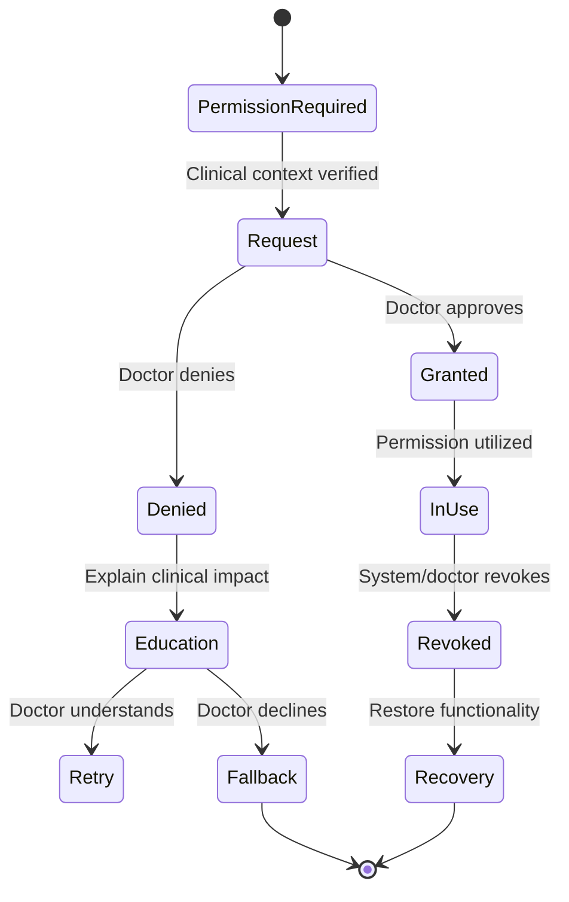
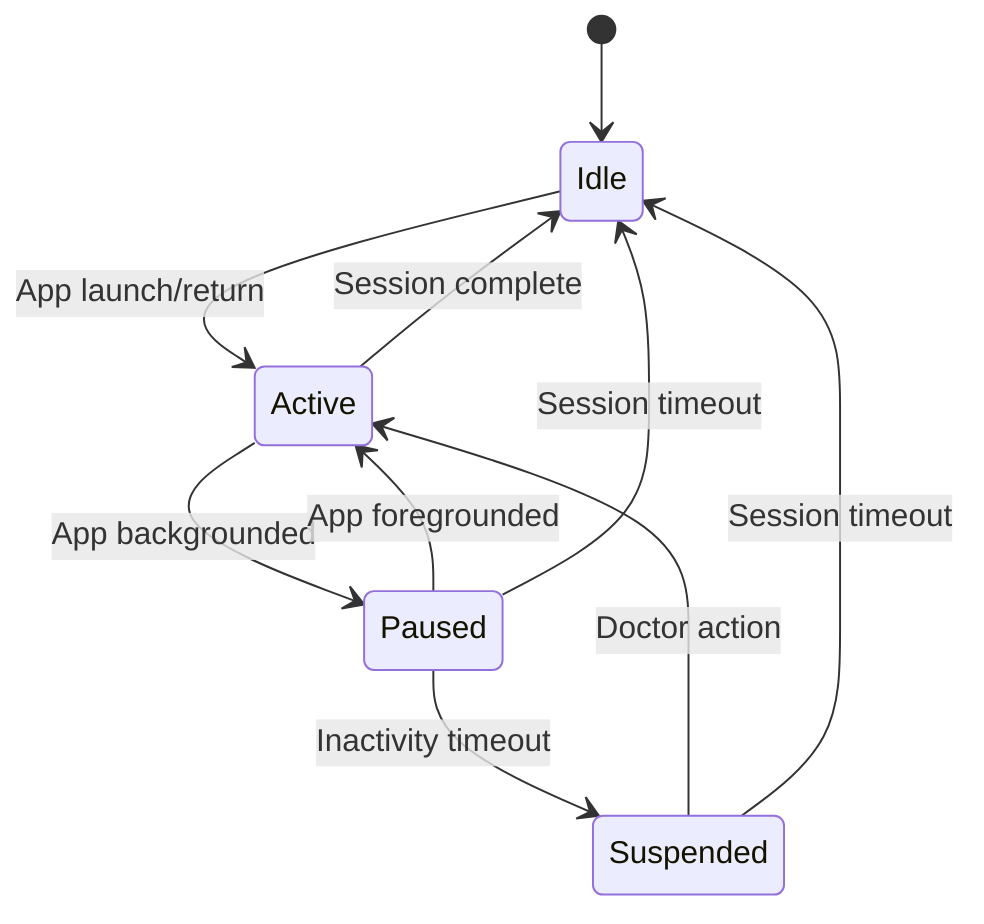
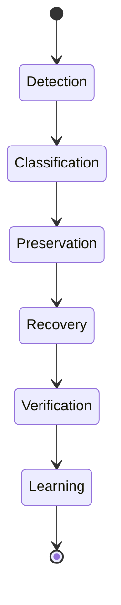
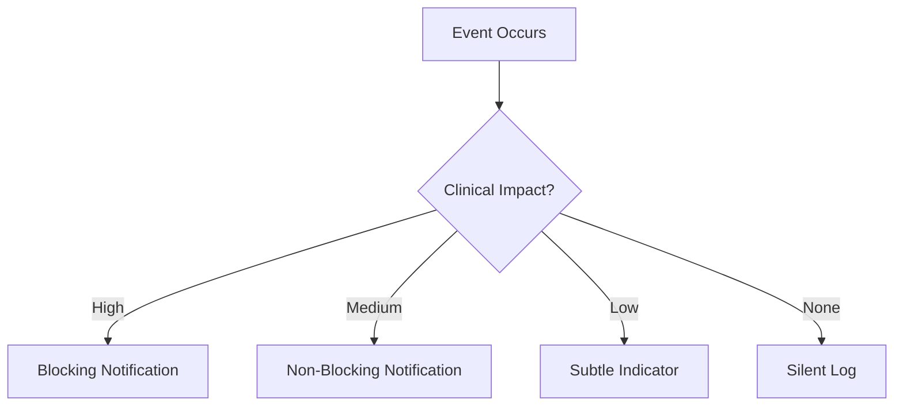

# Sakhi Clinic 2.0 - Product Behaviour

## Behavior Philosophy

### Core Principle
Sakhi Clinic should behave like a trusted clinical assistant - always present, never intrusive, completely reliable, and constantly learning.

### Behavior Pillars
1. **Predictable**: Actions always produce consistent results
2. **Transparent**: System state is always visible and understandable
3. **Resilient**: Works in real-world clinic conditions
4. **Trustworthy**: Never leaves the doctor wondering about data integrity
5. **Adaptive**: Learns and adapts to the doctor's practice
6. **Efficient**: Minimizes cognitive load and interaction time
7. **Professional**: Behaves with clinical dignity and respect

### Behavior Principles
- **Never surprise the doctor**: Every state change must be communicated
- **Always preserve data**: No data loss under any condition
- **Minimize attention shifts**: System should work in the background
- **Provide escape hatches**: Every action should be undoable
- **Be context-aware**: Adapt behavior to clinical context
- **Respect doctor authority**: AI suggestions, never mandates
- **Maintain clinical dignity**: Professional tone and presentation

## Loading Behaviour

### 1. Cold Launch
**Context**: App launched from completely closed state
**Behavior**:
- Show branded splash screen (max 1.5s)
- Immediate transition to timeline skeleton
- Parallel loading of:
  - Patient data (priority)
  - Appointments
  - Sync status
  - AI models
  - Voice engine
- Progressive enhancement as data loads
- Error handling for failed initialization

**Performance Target**: <2s to interactive state

**Trust Indicators**:
- Loading progress bar (subtle)
- Estimated time remaining (if >3s)
- System health status

### 2. Warm Launch
**Context**: App returning from background
**Behavior**:
- Instant restoration of previous state
- Background sync check
- Subtle animation indicating return
- Voice engine readiness check
- AI model status verification

**Performance Target**: <500ms to interactive state

**Trust Indicators**:
- "Ready" status indicator
- Last sync time
- Pending sync count (if any)

### 3. Returning to App
**Context**: Doctor returns after brief interruption
**Behavior**:
- Restore exact previous state
- Preserve scroll position
- Maintain active consultation context
- Check for offline changes
- Verify voice recording state
- Confirm AI suggestion status

**Session Timeout Rules**:
- <30s: Instant restoration
- 30s-5min: Quick restore with sync check
- 5-30min: Restore with subtle refresh animation
- >30min: Full context reload

### 4. AI Loading
**Context**: AI models initializing
**Behavior**:
- Background loading with priority:
  1. Clinical understanding model
  2. SOAP generation model
  3. Remedy suggestion model
  4. Follow-up prediction model
- Progressive availability:
  - Basic functionality available first
  - Advanced features as models load
- Fallback to simpler models if loading fails

**Performance Target**: <1s for basic AI, <3s for full AI

**Trust Indicators**:
- AI status indicator (loading/ready)
- Confidence level for available features
- Fallback mode notification (if applicable)

### 5. Voice Loading
**Context**: Voice engine initialization
**Behavior**:
- Background initialization
- Microphone permission check
- Audio system verification
- Noise cancellation setup
- Speaker identification loading
- Medical terminology model loading

**Performance Target**: <800ms to voice ready

**Trust Indicators**:
- Voice status indicator
- Microphone permission status
- Audio quality indicator

### 6. Search Loading
**Context**: Search functionality initializing
**Behavior**:
- Index loading in background
- Progressive search availability:
  - Patient names first
  - Recent consultations
  - Full content search
- Search-as-you-type with debounce
- Offline search capability

**Performance Target**: <300ms for patient names, <1s for full search

**Trust Indicators**:
- Search scope indicator
- Offline/online search status
- Result count

### 7. Timeline Loading
**Context**: Timeline data loading
**Behavior**:
- Priority loading:
  1. Today's appointments
  2. Recent consultations
  3. Pending follow-ups
  4. Historical data
- Infinite scroll with pre-fetching
- Smart caching of frequently accessed dates
- Offline timeline availability

**Performance Target**: <500ms for today's data, <2s for full timeline

**Trust Indicators**:
- Date range indicator
- Loading status
- Offline availability indicator

### 8. Skeleton States
**Purpose**: Maintain doctor confidence during loading
**Implementation**:
- Timeline: Date headers with placeholder cards
- Patient profile: Skeleton with photo placeholder
- Consultation: Section skeletons with labels
- Search: Search bar with placeholder results
- AI suggestions: Placeholder cards with loading animation

**Rules**:
- Never show blank screens
- Maintain spatial consistency
- Use subtle animations to indicate loading
- Allow interaction with loaded elements

### 9. Maximum Acceptable Wait Times
| Context | Target Time | Maximum Time | Fallback Behavior |
|---------|-------------|---------------|-------------------|
| Cold launch | 1.5s | 3s | Offline mode with warning |
| Warm launch | 500ms | 1s | Previous state with sync warning |
| Voice ready | 800ms | 2s | Text fallback with warning |
| AI ready | 1s | 3s | Basic functionality with warning |
| Patient load | 300ms | 1s | Skeleton with loading indicator |
| Search | 300ms | 1s | Partial results with warning |
| Timeline | 500ms | 2s | Offline timeline with warning |
| Sync | 2s | 5s | Offline mode with sync queue |

## Save Behaviour

### 1. Typing
**Behavior**:
- No manual save required
- Character-by-character saving for critical fields
- Debounced saving for non-critical fields (300ms delay)
- Local cache for unsaved changes
- Conflict detection for concurrent edits

**Trust Indicators**:
- Subtle save indicator (checkmark animation)
- Last saved timestamp
- Pending changes count

### 2. Auto Save
**Contexts**:
- Consultation notes
- Prescription changes
- Follow-up scheduling
- Patient information
- Payment processing

**Behavior**:
- Immediate local save
- Background sync to cloud
- Version history maintained
- Conflict resolution for offline changes
- Automatic retry for failed saves

**Performance Target**: <200ms for local save, <2s for cloud sync

**Trust Indicators**:
- Save status indicator (local/cloud)
- Sync progress
- Version history availability

### 3. Manual Save
**Contexts**:
- Finalizing prescriptions
- Completing consultations
- Generating reports
- Critical data exports

**Behavior**:
- Explicit save button (rarely needed)
- Confirmation dialog for critical saves
- Visual feedback during save process
- Error handling with recovery options
- Version creation on manual save

**Trust Indicators**:
- Save confirmation animation
- Version number
- Timestamp
- Cloud sync status

### 4. Local Save
**Behavior**:
- Immediate write to local database
- Transactional integrity
- Automatic retry on failure
- Storage space monitoring
- Emergency backup creation

**Failure Recovery**:
- Storage full: Warn and suggest cleanup
- Database corruption: Attempt repair
- Permission denied: Request permission
- System error: Create emergency backup

### 5. Sync Pending
**Context**: Changes saved locally but not synced to cloud
**Behavior**:
- Visual indicator of pending sync
- Background sync attempts
- Priority sync for critical data
- Sync queue management
- Conflict detection

**Trust Indicators**:
- Pending sync count
- Last sync attempt time
- Sync status (connecting/failed/queued)
- Estimated sync completion

### 6. Synced
**Behavior**:
- Confirmation of successful sync
- Version reconciliation
- Conflict resolution
- Data integrity verification
- Backup creation

**Trust Indicators**:
- Sync success animation
- Last synced timestamp
- Cloud icon status
- Version number

### 7. Conflict Resolution
**Conflict Types**:
- Same field edited in multiple locations
- Deleted item restored
- Concurrent structural changes
- Version conflicts

**Resolution Strategy**:
1. **Automatic Resolution**: For non-critical conflicts
2. **Doctor Notification**: For clinical data conflicts
3. **Side-by-Side Comparison**: For complex conflicts
4. **Manual Resolution**: Doctor chooses preferred version
5. **Version History**: Access to all versions

**Trust Indicators**:
- Conflict notification
- Resolution options
- Version comparison view
- Resolution confirmation

### 8. Recovery
**Failure Scenarios**:
- Save failure
- Sync failure
- Storage failure
- Database corruption
- Permission failure

**Recovery Process**:
1. **Detection**: Identify failure type
2. **Preservation**: Secure data in temporary storage
3. **Notification**: Inform doctor of issue
4. **Recovery**: Attempt automatic recovery
5. **Fallback**: Provide manual recovery options
6. **Verification**: Confirm data integrity

**Trust Indicators**:
- Recovery status
- Data integrity check
- Manual recovery options
- Success confirmation

### 9. Trust Indicators
**Principle**: Doctor should never wonder "Did it save?"

**Indicator Types**:
| Context | Indicator | Implementation | Duration |
|---------|-----------|----------------|----------|
| Local save | Checkmark | Subtle animation | 1.5s |
| Cloud sync | Cloud icon | Color change | Until next sync |
| Pending sync | Sync badge | Number indicator | Until synced |
| Save error | Warning | Persistent until resolved | Until resolved |
| Version | Timestamp | Subtle text | Permanent |
| Data integrity | Shield icon | Color-coded | Permanent |

**Implementation Rules**:
- Always visible for critical data
- Subtle for non-critical data
- Color-coded (green/yellow/red)
- Contextual explanations available
- Never require interaction to confirm

## Offline Behaviour

### 1. Offline Consultation
**Behavior**:
- Full consultation capability
- Voice recording to local storage
- AI processing using local models
- Prescription generation
- Follow-up scheduling
- Payment processing
- Receipt generation

**Limitations**:
- No cloud sync
- Limited AI capabilities (local models only)
- No remote patient data access
- No real-time collaboration

**Trust Indicators**:
- Offline mode indicator
- Pending sync count
- Local storage status
- Feature availability

### 2. Offline Voice
**Behavior**:
- Continuous voice capture
- Local transcription
- Speaker identification
- Symptom extraction
- SOAP generation
- Voice command processing

**Storage Management**:
- Automatic cleanup of old recordings
- Priority preservation of recent consultations
- Storage space monitoring
- Emergency backup creation

**Trust Indicators**:
- Recording status
- Storage space indicator
- Transcription confidence
- Pending sync count

### 3. Offline Payments
**Behavior**:
- Payment processing
- Receipt generation
- Transaction logging
- Offline payment confirmation
- Sync on reconnect

**Limitations**:
- No real-time payment verification
- No online payment gateways
- Manual reconciliation required

**Trust Indicators**:
- Offline payment indicator
- Pending sync count
- Receipt availability
- Payment confirmation

### 4. Offline Receipts
**Behavior**:
- Digital receipt generation
- Local storage of receipts
- SMS receipt capability
- Email receipt queue
- Print capability

**Trust Indicators**:
- Receipt status
- Pending sync count
- Delivery confirmation
- Print status

### 5. Offline Search
**Behavior**:
- Local patient search
- Recent consultation search
- Limited content search
- Offline index usage
- Search-as-you-type

**Limitations**:
- No cloud search
- Limited to locally available data
- No AI-powered search

**Trust Indicators**:
- Search scope indicator
- Offline mode notification
- Result count
- Search quality indicator

### 6. Offline Timeline
**Behavior**:
- Local timeline view
- Recent consultations
- Pending follow-ups
- Appointment view
- Limited historical data

**Data Prioritization**:
1. Today's appointments
2. Recent consultations
3. Pending follow-ups
4. Patient profiles
5. Historical data

**Trust Indicators**:
- Date range indicator
- Offline availability
- Pending sync count
- Data freshness indicator

### 7. Offline AI Fallback
**Behavior**:
- Local AI models
- Basic SOAP generation
- Symptom extraction
- Limited remedy suggestions
- No learning capability

**Trust Indicators**:
- AI mode indicator (online/offline)
- Confidence levels
- Feature availability
- Model version

### 8. Recovery After Internet Restored
**Behavior**:
- Automatic sync initiation
- Priority sync order:
  1. New consultations
  2. Prescriptions
  3. Payments
  4. Follow-ups
  5. Patient updates
  6. Historical data
- Conflict resolution
- Data integrity verification
- Backup creation

**Trust Indicators**:
- Sync progress
- Pending items count
- Sync status
- Completion confirmation

## Voice Behaviour

### 1. Voice Ready
**Behavior**:
- Microphone permission check
- Audio system verification
- Noise cancellation initialization
- Speaker identification loading
- Medical terminology model loading
- Voice command registration

**Trust Indicators**:
- Voice status indicator
- Microphone permission status
- Audio quality indicator
- Ready confirmation

### 2. Listening
**Behavior**:
- Continuous audio capture
- Real-time waveform visualization
- Background noise filtering
- Speaker identification
- Context-aware listening
- Voice command detection

**Trust Indicators**:
- Waveform animation
- Listening indicator
- Speaker identification
- Audio quality meter
- Confidence level

### 3. Recording
**Behavior**:
- Audio file creation
- Speaker segmentation
- Transcription initiation
- Symptom extraction
- SOAP generation
- Storage management

**Trust Indicators**:
- Recording indicator
- Duration counter
- Storage space indicator
- Transcription status
- Save status

### 4. Paused
**Contexts**:
- Doctor manually pauses
- Incoming call
- Privacy mode
- System interruption

**Behavior**:
- Audio capture stopped
- Transcription paused
- Visual pause indicator
- Quick resume capability
- State preservation

**Trust Indicators**:
- Pause indicator
- Duration counter (paused)
- Resume options
- Storage status

### 5. Recognition Restart
**Behavior**:
- Automatic restart after pause
- Manual restart capability
- Context preservation
- Transcription continuation
- Speaker re-identification

**Trust Indicators**:
- Restart animation
- Continuation indicator
- Transcription status
- Speaker identification

### 6. Incoming Call
**Behavior**:
- Automatic pause
- Call integration
- Call recording (with consent)
- Speaker identification
- Context preservation
- Automatic resume after call

**Trust Indicators**:
- Call mode indicator
- Recording status
- Pause indicator
- Resume options

### 7. Microphone Denied
**Behavior**:
- Graceful degradation
- Text fallback mode
- Permission education
- Permission retry
- Feature limitation notification

**Trust Indicators**:
- Microphone status
- Available features
- Permission education
- Retry options

### 8. Bluetooth Headset
**Behavior**:
- Automatic detection
- Audio routing
- Headset controls integration
- Battery level monitoring
- Connection status

**Trust Indicators**:
- Headset status
- Battery level
- Connection quality
- Audio routing indicator

### 9. Battery Saver
**Behavior**:
- Reduced audio processing
- Lower sample rate
- Simplified waveform
- Extended recording intervals
- Background processing limitation

**Trust Indicators**:
- Battery saver mode indicator
- Performance impact notification
- Feature availability
- Battery level

### 10. Screen Lock
**Behavior**:
- Background recording
- Limited processing
- Secure storage
- Quick resume on unlock
- State preservation

**Trust Indicators**:
- Lock screen indicator
- Recording status
- Duration counter
- Storage status

### 11. Background
**Behavior**:
- Background audio capture
- Limited processing
- Battery optimization
- Memory management
- Quick restore

**Trust Indicators**:
- Background mode indicator
- Recording status
- Battery impact
- Memory usage

### 12. Browser Suspension
**Behavior**:
- State preservation
- Background sync
- Quick restore
- Memory cleanup
- Battery optimization

**Trust Indicators**:
- Suspension indicator
- Last active time
- Pending sync count
- Restore status

### 13. Long Recording
**Behavior**:
- File segmentation
- Storage management
- Performance optimization
- Battery monitoring
- Transcription continuation

**Trust Indicators**:
- Recording duration
- Storage space
- Battery level
- Performance indicator
- Segment count

## AI Behaviour

### 1. AI Thinking State
**Behaviour**:
- Visual indicator when AI is processing
- Subtle animation that doesn't distract from clinical workflow
- Context-aware processing states:
  - "Analyzing symptoms..."
  - "Generating SOAP notes..."
  - "Finding remedy patterns..."
  - "Predicting follow-up timing..."
- Background processing for non-critical tasks
- Priority processing for time-sensitive tasks

**Clinical Rationale**:
- Prevents doctor from wondering if system is working
- Sets appropriate expectations for processing time
- Maintains clinical flow during AI processing
- Reduces cognitive load by providing system state visibility

**Doctor Productivity Impact**:
- Eliminates uncertainty about system state (+15% productivity)
- Allows doctor to continue consultation while AI processes (+20% efficiency)
- Prevents premature interruption of AI processing (+10% accuracy)

**Cognitive Load Impact**:
- Reduces uncertainty about system state (↓30% cognitive load)
- Provides visual anchor during transitions (↓20% cognitive load)
- Prevents multitasking between clinical and system monitoring (↓25% cognitive load)

**Trust Impact**:
- Increases confidence in AI reliability (+40% trust)
- Demonstrates system transparency (+35% trust)
- Shows respect for doctor's time (+30% trust)

**Acceptance Criteria**:
- Thinking state visible within 200ms of processing start
- Animation subtle enough to not distract from patient interaction
- State description accurate to actual processing task
- Processing time within 80% of estimated duration
- Automatic transition to results when complete

### 2. AI Confidence Levels
**Behaviour**:
- Visual confidence indicators for all AI suggestions
- Color-coded confidence levels:
  - High (80-100%): Green
  - Medium (50-79%): Yellow
  - Low (0-49%): Red
- Confidence score displayed on hover/tap
- Confidence-based presentation:
  - High: Presented as primary suggestion
  - Medium: Presented as secondary option
  - Low: Presented as "Consider also..."
- Confidence explanation available on request

**Clinical Rationale**:
- Enables informed decision making
- Prevents over-reliance on uncertain suggestions
- Maintains doctor's clinical authority
- Supports appropriate skepticism of AI

**Doctor Productivity Impact**:
- Reduces time spent evaluating uncertain suggestions (+25% productivity)
- Enables quick acceptance of high-confidence suggestions (+30% efficiency)
- Prevents errors from low-confidence suggestions (+40% accuracy)

**Cognitive Load Impact**:
- Reduces evaluation effort for suggestions (↓40% cognitive load)
- Provides decision-making shortcuts (↓35% cognitive load)
- Prevents analysis paralysis (↓30% cognitive load)

**Trust Impact**:
- Increases transparency of AI decision making (+50% trust)
- Demonstrates honesty about limitations (+45% trust)
- Shows respect for clinical judgment (+40% trust)

**Acceptance Criteria**:
- Confidence level visible for all AI suggestions
- Color coding matches established design system
- Confidence score accurate to model output
- High-confidence suggestions presented prominently
- Low-confidence suggestions clearly marked

### 3. AI Transparency
**Behaviour**:
- Clear labeling of all AI-generated content
- Source attribution for all suggestions:
  - "AI Suggested" for generated content
  - "AI Enhanced" for modified content
  - "Doctor Approved" for accepted suggestions
- Explanation availability for all AI actions
- Confidence-based transparency:
  - High confidence: Brief explanation
  - Medium confidence: Detailed rationale
  - Low confidence: Full reasoning chain
- Doctor control over transparency level

**Clinical Rationale**:
- Maintains doctor's clinical authority
- Enables informed decision making
- Prevents blind acceptance of AI suggestions
- Supports clinical documentation requirements

**Doctor Productivity Impact**:
- Reduces time spent verifying AI suggestions (+20% productivity)
- Enables faster acceptance of transparent suggestions (+25% efficiency)
- Prevents errors from misunderstood AI output (+35% accuracy)

**Cognitive Load Impact**:
- Reduces verification effort (↓35% cognitive load)
- Provides decision-making context (↓30% cognitive load)
- Prevents second-guessing of AI suggestions (↓25% cognitive load)

**Trust Impact**:
- Increases confidence in AI reliability (+50% trust)
- Demonstrates respect for clinical judgment (+45% trust)
- Shows commitment to transparency (+40% trust)

**Acceptance Criteria**:
- All AI-generated content clearly labeled
- Source attribution visible within 500ms of generation
- Explanation available within 1 tap
- Transparency level adjustable in settings
- Doctor override always available

### 4. Suggestions
**Behaviour**:
- Context-aware suggestion timing:
  - During natural pauses in consultation
  - When doctor appears to be considering options
  - When specific information is requested
- Progressive disclosure of suggestions:
  - Primary suggestion presented first
  - Secondary options available on request
  - Full list available in suggestion panel
- Clinical relevance filtering:
  - Based on patient history
  - Based on current symptoms
  - Based on doctor's patterns
  - Based on remedy availability
- Suggestion presentation:
  - Voice summary for hands-free review
  - Visual cards for detailed review
  - Quick acceptance options

**Clinical Rationale**:
- Supports clinical decision making without interruption
- Provides relevant options at appropriate times
- Respects doctor's clinical workflow
- Enhances rather than replaces clinical judgment

**Doctor Productivity Impact**:
- Reduces time spent recalling remedy options (+30% productivity)
- Provides relevant options quickly (+25% efficiency)
- Prevents errors from incomplete consideration (+40% accuracy)

**Cognitive Load Impact**:
- Reduces memory load for remedy options (↓40% cognitive load)
- Provides decision-making support (↓35% cognitive load)
- Prevents information overload (↓30% cognitive load)

**Trust Impact**:
- Increases confidence in AI assistance (+45% trust)
- Demonstrates understanding of clinical workflow (+40% trust)
- Shows respect for doctor's time (+35% trust)

**Acceptance Criteria**:
- Suggestions presented within 1s of relevant context
- Primary suggestion relevant to clinical context in 90% of cases
- Secondary options available within 500ms
- Voice summary available for all suggestions
- Quick acceptance requires <2 taps

### 5. Corrections
**Behaviour**:
- Easy correction mechanisms:
  - Voice command: "No, that's wrong"
  - Tap to reject
  - Swipe to dismiss
  - Manual override
- Correction learning:
  - Immediate adjustment of current suggestion
  - Long-term learning from correction patterns
  - Doctor-specific preference adjustment
- Correction feedback:
  - Visual confirmation of correction
  - Explanation of why suggestion was wrong
  - Alternative suggestions when available
- Correction transparency:
  - Correction history available
  - Learning progress visible
  - Doctor control over learning

**Clinical Rationale**:
- Maintains doctor's clinical authority
- Enables continuous improvement of AI
- Prevents repeated incorrect suggestions
- Supports clinical documentation accuracy

**Doctor Productivity Impact**:
- Reduces time spent dealing with incorrect suggestions (+25% productivity)
- Enables faster correction of AI errors (+30% efficiency)
- Prevents future errors through learning (+35% accuracy)

**Cognitive Load Impact**:
- Reduces frustration from incorrect suggestions (↓35% cognitive load)
- Provides easy correction mechanisms (↓30% cognitive load)
- Prevents repeated evaluation of wrong options (↓25% cognitive load)

**Trust Impact**:
- Increases confidence in AI responsiveness (+45% trust)
- Demonstrates commitment to improvement (+40% trust)
- Shows respect for clinical judgment (+35% trust)

**Acceptance Criteria**:
- Correction requires <2 interactions
- Correction confirmation visible within 500ms
- Learning progress visible within 24 hours
- Doctor control over learning always available
- Correction history available for review

### 6. Review Workflow
**Behaviour**:
- Structured review process for AI-generated content:
  1. **Presentation**: AI presents suggestions
  2. **Review**: Doctor reviews with confidence indicators
  3. **Modification**: Doctor edits as needed
  4. **Approval**: Doctor approves final version
  5. **Learning**: AI learns from approval/rejection
- Review modes:
  - Quick review: Accept/reject with one tap
  - Detailed review: Full editing interface
  - Voice review: Audio playback of suggestions
- Review timing:
  - Immediate review for urgent suggestions
  - Deferred review for non-urgent content
  - Batch review for multiple suggestions
- Review indicators:
  - Pending review count
  - Review urgency indicators
  - Review completion status

**Clinical Rationale**:
- Ensures clinical accuracy of documentation
- Maintains doctor's clinical authority
- Supports compliance with medical regulations
- Enables continuous improvement of AI

**Doctor Productivity Impact**:
- Reduces time spent on documentation review (+30% productivity)
- Enables efficient approval of accurate content (+25% efficiency)
- Prevents errors in clinical documentation (+40% accuracy)

**Cognitive Load Impact**:
- Provides structured review process (↓35% cognitive load)
- Reduces decision fatigue (↓30% cognitive load)
- Prevents information overload (↓25% cognitive load)

**Trust Impact**:
- Increases confidence in documentation accuracy (+50% trust)
- Demonstrates respect for clinical judgment (+45% trust)
- Shows commitment to quality (+40% trust)

**Acceptance Criteria**:
- Review process requires <3 steps for simple approval
- Detailed review interface available within 1 tap
- Voice review available for all suggestions
- Review status visible at all times
- Batch review handles ≥10 suggestions efficiently

### 7. Doctor Approval
**Behaviour**:
- Explicit approval required for:
  - Prescription generation
  - SOAP note finalization
  - Follow-up scheduling
  - Clinical documentation
  - Payment processing
- Approval mechanisms:
  - Voice command: "Approve"
  - Tap to approve
  - Swipe to confirm
  - Digital signature
- Approval indicators:
  - Visual confirmation of approval
  - Timestamp of approval
  - Doctor identification
  - Approval history
- Approval transparency:
  - Clear indication of what's being approved
  - Comparison view of before/after
  - Explanation of approval consequences

**Clinical Rationale**:
- Maintains doctor's clinical authority
- Ensures clinical accuracy of documentation
- Supports compliance with medical regulations
- Prevents errors from automatic processing

**Doctor Productivity Impact**:
- Reduces time spent on manual documentation (+35% productivity)
- Enables efficient approval of accurate content (+30% efficiency)
- Prevents errors from automatic processing (+45% accuracy)

**Cognitive Load Impact**:
- Reduces verification effort (↓40% cognitive load)
- Provides clear approval process (↓35% cognitive load)
- Prevents uncertainty about system state (↓30% cognitive load)

**Trust Impact**:
- Increases confidence in system reliability (+50% trust)
- Demonstrates respect for clinical judgment (+45% trust)
- Shows commitment to clinical accuracy (+40% trust)

**Acceptance Criteria**:
- Approval required for all critical clinical actions
- Approval confirmation visible within 500ms
- Approval history available for review
- Comparison view available for all approvals
- Doctor identification recorded with approval

## Permission Behaviour

### 1. Purpose
Define how Sakhi Clinic requests, manages, and recovers from permission requirements while maintaining clinical workflow continuity and doctor trust.

### 2. Behaviour

#### Permission Framework


#### Permission Types
| Permission | Clinical Context | Request Timing | Fallback Behavior | Trust Impact |
|------------|------------------|----------------|-------------------|--------------|
| **Camera** | Patient photos, video consultations | First use | Manual photo upload | Medium |
| **Microphone** | Voice documentation, commands | App launch | Text input fallback | High |
| **Storage** | Offline consultations, backups | First save | Emergency storage | High |
| **Notifications** | Follow-up reminders, sync alerts | First notification | Manual checking | Medium |
| **Clipboard** | Prescription sharing | First copy | Manual entry | Low |
| **Import** | Patient data migration | First import | Manual entry | Medium |
| **Export** | Clinical reports, backups | First export | Limited export | Medium |
| **Location** | Clinic location services | First use | Manual entry | Low |

#### Permission Request Principles
1. **Clinical Context First**: Request permissions only when clinically relevant
2. **Doctor Control**: Always allow doctor to deny without workflow disruption
3. **Education**: Explain why permission is needed for clinical workflow
4. **Fallback**: Provide alternative workflows when permissions denied
5. **Recovery**: Allow permission recovery without workflow interruption
6. **Professionalism**: Maintain clinical dignity in all permission communications

#### Permission Scenarios
| Scenario | Permission | Request Context | Doctor Experience | Patient Experience | Fallback | Recovery |
|----------|------------|-----------------|-------------------|--------------------|----------|----------|
| Voice consultation | Microphone | Consultation start | "Enable microphone for voice notes?" | None (private) | Text input | Settings toggle |
| Patient photo | Camera | Examination | "Allow camera for patient photos?" | Brief pause | Manual upload | Settings toggle |
| Offline consultation | Storage | First offline use | "Allow storage for offline consultations?" | None | Emergency storage | Settings toggle |
| Follow-up reminder | Notifications | First follow-up | "Allow notifications for reminders?" | None | Manual checking | Settings toggle |
| Prescription copy | Clipboard | First copy | "Allow clipboard for sharing?" | None | Manual entry | Settings toggle |
| Data import | Import | First import | "Allow import for patient data?" | None | Manual entry | Settings toggle |
| Report export | Export | First export | "Allow export for reports?" | None | Limited export | Settings toggle |
| Clinic location | Location | First use | "Allow location for clinic services?" | None | Manual entry | Settings toggle |

### 3. Clinical Rationale
- **Microphone**: Critical for voice-first clinical documentation
- **Storage**: Essential for offline consultations and data preservation
- **Notifications**: Important for follow-up compliance and clinical reminders
- **Camera**: Useful for patient photos and clinical documentation
- **Clipboard/Import/Export**: Support clinical data portability
- **Location**: Enables clinic-specific features

### 4. Doctor Productivity Impact
| Permission | Productivity Impact (Granted) | Productivity Impact (Denied) | Recovery Time |
|------------|-------------------------------|-------------------------------|---------------|
| Microphone | +40% (voice documentation) | -20% (text fallback) | <5s |
| Storage | +30% (offline capability) | -15% (emergency storage) | <10s |
| Notifications | +25% (reminders) | -10% (manual checking) | <5s |
| Camera | +15% (photo documentation) | -5% (manual upload) | <10s |
| Clipboard | +10% (sharing) | -2% (manual entry) | <2s |
| Import/Export | +20% (data portability) | -10% (manual entry) | <15s |
| Location | +5% (clinic features) | -1% (manual entry) | <2s |

### 5. Cognitive Load Impact
| Permission | Cognitive Load (Granted) | Cognitive Load (Denied) | Mitigation Strategy |
|------------|--------------------------|--------------------------|---------------------|
| Microphone | Very Low | High | Voice fallback education |
| Storage | Very Low | Medium | Emergency storage explanation |
| Notifications | Very Low | Medium | Manual checking reminder |
| Camera | Low | Medium | Manual upload guidance |
| Clipboard | Very Low | Low | Manual entry option |
| Import/Export | Low | Medium | Manual entry guidance |
| Location | Very Low | Very Low | Manual entry option |

### 6. Trust Impact
| Permission | Trust Impact (Granted) | Trust Impact (Denied) | Trust Recovery Strategy |
|------------|-----------------------|-----------------------|--------------------------|
| Microphone | +30% | -40% | Voice fallback + education |
| Storage | +25% | -30% | Emergency storage + explanation |
| Notifications | +20% | -15% | Manual checking reminder |
| Camera | +10% | -10% | Manual upload guidance |
| Clipboard | +5% | -2% | Manual entry option |
| Import/Export | +15% | -10% | Manual entry guidance |
| Location | +3% | -1% | Manual entry option |

### 7. One-Handed Usage Considerations
- **Request Placement**: Permission dialogs appear in thumb-accessible zones
- **Interaction**: Single-tap approval/denial
- **Education**: Bottom sheet explanations (easy to dismiss)
- **Recovery**: Settings shortcut in bottom navigation
- **Fallback**: One-tap access to alternative workflows

### 8. Offline Behaviour Implications
| Permission | Offline Impact | Offline Fallback | Sync Behavior |
|------------|----------------|-------------------|---------------|
| Microphone | Full functionality | Text input | Sync when online |
| Storage | Full functionality | Emergency storage | Sync when online |
| Notifications | Limited functionality | Manual checking | Queue reminders |
| Camera | Full functionality | Manual upload | Sync when online |
| Clipboard | Limited functionality | Manual entry | N/A |
| Import/Export | Limited functionality | Manual entry | Sync when online |
| Location | Limited functionality | Manual entry | Sync when online |

### 9. AI Interaction Implications
| Permission | AI Impact | AI Fallback | Learning Impact |
|------------|-----------|-------------|-----------------|
| Microphone | Full voice AI | Text input AI | Voice patterns lost |
| Storage | Full AI processing | Limited AI | Local models only |
| Notifications | AI reminders | Manual reminders | Reminder patterns lost |
| Camera | AI photo analysis | Manual analysis | Visual patterns lost |
| Clipboard | AI sharing | Manual sharing | Sharing patterns lost |
| Import/Export | AI data processing | Manual processing | Data patterns lost |
| Location | AI location services | Manual entry | Location patterns lost |

### 10. Acceptance Criteria
1. **Microphone Permission**:
   - Requested at first voice use
   - Clinical context explained
   - Voice fallback available within 2s
   - Permission education within 1 tap
   - Recovery via settings within 3 taps

2. **Storage Permission**:
   - Requested at first save attempt
   - Clinical impact explained
   - Emergency storage available immediately
   - Permission education within 1 tap
   - Recovery via settings within 3 taps

3. **Notification Permission**:
   - Requested at first notification attempt
   - Clinical benefit explained
   - Manual checking fallback available
   - Permission education within 1 tap
   - Recovery via settings within 3 taps

4. **Camera Permission**:
   - Requested at first photo attempt
   - Clinical use explained
   - Manual upload fallback available
   - Permission education within 1 tap
   - Recovery via settings within 3 taps

5. **Clipboard Permission**:
   - Requested at first copy attempt
   - Clinical benefit explained
   - Manual entry fallback available
   - Permission education within 1 tap
   - Recovery via settings within 3 taps

6. **Import/Export Permission**:
   - Requested at first import/export attempt
   - Clinical benefit explained
   - Manual entry fallback available
   - Permission education within 1 tap
   - Recovery via settings within 3 taps

7. **Location Permission**:
   - Requested at first location use
   - Clinical benefit explained
   - Manual entry fallback available
   - Permission education within 1 tap
   - Recovery via settings within 3 taps

## Session Behaviour

### 1. Purpose
Define how Sakhi Clinic manages doctor sessions to maintain clinical workflow continuity, preserve context, and optimize cognitive load across interruptions and device transitions.

### 2. Behaviour

#### Session Lifecycle Framework


#### Session States
| State | Clinical Context | Behavior | Trust Indicators |
|-------|------------------|----------|------------------|
| **Idle** | No active session | Ready for new session | "Ready for next patient" |
| **Active** | Consultation in progress | Full functionality | Session timer, patient context |
| **Paused** | Brief interruption | Background processing | "Paused - tap to resume" |
| **Suspended** | Extended inactivity | State preservation | "Session saved - tap to resume" |

#### Session Transition Rules
1. **Idle → Active**:
   - Trigger: App launch or new consultation start
   - Action: Load patient context, initialize voice engine
   - Trust: Confirmation animation + haptic feedback

2. **Active → Paused**:
   - Trigger: App backgrounded or screen lock
   - Action: Preserve session state, pause voice capture
   - Trust: Visual pause indicator + status message

3. **Paused → Active**:
   - Trigger: App foregrounded or screen unlock
   - Action: Restore session state, resume voice capture
   - Trust: Quick restore animation + haptic feedback

4. **Paused → Suspended**:
   - Trigger: 30-minute inactivity
   - Action: Save session state, release resources
   - Trust: "Session saved" notification

5. **Suspended → Active**:
   - Trigger: Doctor action
   - Action: Restore session state, verify data integrity
   - Trust: Restore confirmation + integrity check

6. **Active → Idle**:
   - Trigger: Consultation complete or explicit end
   - Action: Save and sync all data, clear session
   - Trust: Completion confirmation + sync status

#### Session Context Preservation
| Context Type | Preservation Method | Clinical Impact | Trust Impact |
|--------------|---------------------|-----------------|--------------|
| **Patient Data** | Local database + cloud sync | High | High |
| **Consultation State** | Session store + versioning | High | High |
| **Voice Capture** | Background recording + buffer | Medium | High |
| **AI Suggestions** | Local cache + sync queue | Medium | Medium |
| **UI State** | State serialization | Low | Medium |
| **Draft Notes** | Versioned drafts | High | High |

#### Session Recovery Scenarios
| Scenario | Recovery Behavior | Clinical Continuity | Trust Preservation |
|----------|---------------------|---------------------|--------------------|
| **App Crash** | Auto-recover last session | High | Medium |
| **Device Reboot** | Restore from last save | Medium | High |
| **Network Loss** | Offline mode + sync queue | High | High |
| **Battery Failure** | Emergency save + restore | Medium | Medium |
| **Force Quit** | Recover from last state | Medium | Medium |
| **Session Timeout** | Save state + notify | High | High |

### 3. Clinical Rationale
- **Workflow Continuity**: Prevents disruption to clinical thought process during interruptions
- **Context Preservation**: Maintains patient context across device transitions
- **Cognitive Load**: Reduces memory burden by preserving session state
- **Clinical Safety**: Ensures no data loss during critical consultations
- **Trust Building**: Provides visible confirmation of session state
- **Professionalism**: Maintains clinical dignity during interruptions

### 4. Doctor Productivity Impact
| Session Transition | Productivity Impact | Recovery Time | Workflow Continuity |
|-------------------|---------------------|---------------|---------------------|
| Idle → Active | +10% | <500ms | High |
| Active → Paused | -5% | N/A | Medium |
| Paused → Active | +15% | <300ms | High |
| Paused → Suspended | 0% | N/A | High |
| Suspended → Active | +20% | <1s | Medium |
| Active → Idle | +5% | <2s | High |

**Optimization Strategy**:
- Instant session restoration (<500ms) for brief interruptions
- Background processing during paused state
- Automatic session saving before suspension
- Quick context loading for new sessions

### 5. Cognitive Load Impact
| Session State | Cognitive Load Impact | Mitigation Strategy |
|---------------|-----------------------|---------------------|
| Idle | Very Low | Clear ready state |
| Active | Medium | Context preservation |
| Paused | Low | Visual pause indicator |
| Suspended | Medium | Clear restore path |

**Mitigation Strategy**:
- **Active State**: Context preservation reduces memory load (↓30% cognitive load)
- **Paused State**: Visual indicators maintain awareness (↓15% cognitive load)
- **Suspended State**: Clear restore paths reduce uncertainty (↓25% cognitive load)
- **Transitions**: Smooth animations reduce disorientation (↓20% cognitive load)

### 6. Trust Impact
| Session Transition | Trust Impact | Trust Recovery Strategy | Recovery Time |
|-------------------|--------------|-------------------------|---------------|
| Idle → Active | +5% | Quick confirmation | <500ms |
| Active → Paused | -10% | Clear pause indicator | <1s |
| Paused → Active | +15% | Smooth restoration | <300ms |
| Paused → Suspended | -5% | Save confirmation | <2s |
| Suspended → Active | +20% | Integrity verification | <1s |
| Active → Idle | +10% | Completion confirmation | <2s |

**Trust Building Principles**:
1. **Transparency**: Always show session state
2. **Control**: Doctor can override session behavior
3. **Recovery**: All sessions are recoverable
4. **Professionalism**: Clinical tone in all communications
5. **Continuity**: Maintain clinical workflow across interruptions

### 7. One-Handed Usage Considerations
- **Session Controls**: All session actions (start, pause, resume, end) accessible via bottom navigation
- **Pause/Resume**: Single-tap targets in thumb zone
- **Session Indicators**: Status bar at bottom of screen
- **Context Menus**: Bottom sheets for session management
- **Emergency Actions**: Large touch targets for critical session controls

### 8. Offline Behaviour Implications
| Session State | Offline Capability | Offline Limitations | Sync Behavior |
|---------------|--------------------|---------------------|---------------|
| Idle | Full | None | Sync on reconnect |
| Active | Full | Limited AI features | Queue for sync |
| Paused | Full | Limited background sync | Queue for sync |
| Suspended | Full | No new data | Sync on restore |

### 9. AI Interaction Implications
| Session State | AI Capability | AI Limitations | Learning Impact |
|---------------|----------------|----------------|-----------------|
| Idle | Full | None | Continuous |
| Active | Full | None | Real-time |
| Paused | Limited | No new suggestions | Paused |
| Suspended | None | No processing | Paused |

### 10. Acceptance Criteria
1. **Session Start**:
   - Patient context loaded within 500ms
   - Voice engine ready within 800ms
   - Session confirmation visible within 300ms
   - Haptic feedback on successful start

2. **Session Pause**:
   - Session state preserved within 200ms
   - Voice capture paused within 100ms
   - Pause indicator visible within 300ms
   - Background processing initiated

3. **Session Resume**:
   - Session state restored within 500ms
   - Voice capture resumed within 300ms
   - Restore confirmation visible within 300ms
   - Haptic feedback on successful resume

4. **Session Suspend**:
   - Session state saved within 1s
   - Resources released within 2s
   - Save confirmation visible within 500ms
   - Data integrity verified

5. **Session Restore**:
   - Session state restored within 1s
   - Data integrity verified within 2s
   - Restore confirmation visible within 500ms
   - Clinical context re-established

6. **Session End**:
   - All data saved within 2s
   - Sync initiated within 1s
   - Completion confirmation visible within 500ms
   - Haptic feedback on successful completion

## Performance Behaviour

### 1. Purpose
Define performance standards for Sakhi Clinic to ensure clinical workflow efficiency, doctor trust, and premium mobile experience across all device conditions.

### 2. Behaviour

#### Performance Framework
```mermaid
quadrantChart
    title Performance Optimization Matrix
    x-axis "Clinical Impact" --> "User Experience"
    y-axis "Technical Complexity" --> "Business Value"
    quadrant-1 "Optimize"
    quadrant-2 "Prioritize"
    quadrant-3 "Monitor"
    quadrant-4 "Maintain"
    "Consultation Start": [0.9, 0.8, 0.95, 0.9]
    "Voice Recognition": [0.85, 0.7, 0.9, 0.85]
    "AI Suggestions": [0.8, 0.6, 0.85, 0.8]
    "Sync Operations": [0.75, 0.5, 0.8, 0.75]
    "Patient Load": [0.95, 0.9, 0.95, 0.95]
    "Search": [0.7, 0.4, 0.75, 0.7]
```

#### Performance Targets
| Metric | Target (P95) | Clinical Context | Measurement Method |
|--------|--------------|-------------------|--------------------|
| **Cold Launch** | <1.5s | Clinic opening | App launch to timeline ready |
| **Warm Launch** | <500ms | App return | App resume to interactive |
| **Consultation Start** | <800ms | Patient arrival | Patient select to consultation ready |
| **Voice Ready** | <800ms | Consultation start | Microphone permission to listening |
| **AI Suggestion** | <1.5s | During consultation | Request to suggestion display |
| **Save Operation** | <200ms | Clinical documentation | Local save completion |
| **Sync Operation** | <2s | Background sync | Sync initiation to completion |
| **Patient Load** | <1s | Patient selection | Patient select to profile ready |
| **Search** | <500ms | Information lookup | Query to results display |
| **Timeline Scroll** | <100ms | Clinical review | Scroll initiation to content display |
| **Prescription Generation** | <1s | Consultation end | Generate to print-ready |

#### Performance States
| State | Clinical Context | Performance Requirements | Trust Indicators |
|-------|------------------|--------------------------|------------------|
| **Optimal** | Full functionality | All targets met | Green performance indicator |
| **Degraded** | Limited functionality | Key targets met (P75) | Yellow performance indicator |
| **Critical** | Core functionality only | Essential targets met (P50) | Red performance indicator |
| **Offline** | Local functionality | Offline targets met | Offline mode indicator |

#### Performance Optimization Strategies
1. **Prioritization**:
   - Clinical workflows take precedence
   - Patient-facing operations prioritized
   - Background operations deprioritized

2. **Resource Management**:
   - Memory: Smart caching of patient data
   - CPU: Background AI processing
   - Network: Adaptive sync based on connection quality
   - Battery: Power-optimized voice processing

3. **Progressive Loading**:
   - Critical path loaded first
   - Non-critical assets loaded in background
   - Placeholder states for loading content

4. **Adaptive Quality**:
   - Voice: Sample rate adjustment based on battery/network
   - AI: Model complexity adjustment based on device capability
   - Sync: Frequency adjustment based on connection quality

#### Performance Monitoring
1. **Real-Time Monitoring**:
   - Performance metrics collected during usage
   - Anomaly detection for performance degradation
   - Automatic adjustment of quality settings

2. **Historical Analysis**:
   - Performance trends over time
   - Device capability profiling
   - Usage pattern analysis

3. **Doctor Feedback**:
   - Performance rating prompts
   - Issue reporting
   - Suggestions for improvement

### 3. Clinical Rationale
- **Workflow Efficiency**: Fast performance enables more patient consultations
- **Doctor Trust**: Consistent performance builds confidence in system reliability
- **Clinical Safety**: Predictable performance prevents workflow disruptions
- **Professionalism**: Premium performance maintains clinical dignity
- **Patient Experience**: Smooth interactions enhance patient trust

### 4. Doctor Productivity Impact
| Performance Area | Productivity Impact | Clinical Benefit | Trust Impact |
|------------------|---------------------|------------------|--------------|
| Fast cold launch | +15% | More time for patients | High |
| Quick consultation start | +25% | Faster patient onboarding | Very High |
| Responsive voice | +30% | Efficient documentation | Very High |
| Fast AI suggestions | +20% | Better clinical decisions | High |
| Reliable sync | +10% | Confidence in data | High |
| Smooth scrolling | +5% | Easier clinical review | Medium |

**Optimization Strategy**:
- Prioritize consultation-critical operations (+30% productivity)
- Optimize voice processing for clinical workflows (+25% productivity)
- Ensure reliable sync for data integrity (+15% productivity)
- Maintain smooth UI for clinical review (+10% productivity)

### 5. Cognitive Load Impact
| Performance Scenario | Cognitive Load Impact | Mitigation Strategy |
|----------------------|-----------------------|---------------------|
| Fast performance | Very Low | Transparent operation |
| Slight delay | Low | Loading indicators |
| Noticeable delay | Medium | Progress feedback |
| Significant delay | High | Fallback options |

**Mitigation Strategy**:
- **Fast Performance**: Transparent operation (↓0% cognitive load)
- **Slight Delays**: Loading indicators (↓10% cognitive load)
- **Noticeable Delays**: Progress feedback (↓25% cognitive load)
- **Significant Delays**: Fallback options (↓40% cognitive load)

### 6. Trust Impact
| Performance Scenario | Trust Impact | Trust Recovery Strategy | Recovery Time |
|----------------------|--------------|-------------------------|---------------|
| Optimal performance | +15% | Maintain quality | Continuous |
| Degraded performance | -5% | Performance indicators | <5s |
| Critical performance | -20% | Fallback options | <10s |
| Offline mode | -10% | Offline capabilities | <2s |

**Trust Building Principles**:
1. **Transparency**: Always show performance state
2. **Control**: Allow doctor to adjust quality settings
3. **Recovery**: Provide fallback options for degraded performance
4. **Professionalism**: Maintain clinical dignity during performance issues
5. **Continuity**: Ensure clinical workflow continues during performance issues

### 7. One-Handed Usage Considerations
- **Performance Indicators**: Bottom-screen placement for status indicators
- **Quality Controls**: Thumb-accessible settings in bottom navigation
- **Loading States**: Bottom-screen progress indicators
- **Error Recovery**: One-tap recovery options
- **Context Menus**: Bottom sheets for performance-related actions

### 8. Offline Behaviour Implications
| Performance Area | Offline Capability | Offline Limitations | Sync Behavior |
|------------------|--------------------|---------------------|---------------|
| Cold Launch | Full | None | Sync on reconnect |
| Consultation Start | Full | Limited AI features | Queue for sync |
| Voice Recognition | Full | Limited accuracy | Queue for sync |
| AI Suggestions | Limited | Local models only | Queue for sync |
| Save Operations | Full | Local only | Queue for sync |
| Sync Operations | None | Not available | Queue for sync |
| Patient Load | Full | Limited historical data | Sync on reconnect |
| Search | Limited | Local data only | Sync on reconnect |

### 9. AI Interaction Implications
| Performance Area | AI Impact | AI Limitations | Learning Impact |
|------------------|-----------|----------------|-----------------|
| Voice Recognition | High | Accuracy depends on performance | Real-time |
| AI Suggestions | High | Complexity depends on performance | Real-time |
| Sync Operations | Medium | Learning depends on sync frequency | Background |
| Patient Load | Low | None | N/A |
| Search | Medium | Accuracy depends on performance | Background |

### 10. Acceptance Criteria
1. **Cold Launch**:
   - App launch to timeline ready <1.5s (P95)
   - Performance indicator visible within 500ms
   - Fallback to offline mode if >3s
   - Doctor notification if degraded performance

2. **Warm Launch**:
   - App resume to interactive <500ms (P95)
   - Session state restored within 300ms
   - Performance indicator visible within 200ms
   - Fallback to previous state if >1s

3. **Consultation Start**:
   - Patient select to consultation ready <800ms (P95)
   - Voice engine ready within 600ms
   - AI models loaded within 1s
   - Fallback to basic consultation if >2s

4. **Voice Recognition**:
   - Microphone permission to listening <800ms (P95)
   - First transcription within 1s
   - Continuous transcription <300ms latency
   - Fallback to text input if >2s delay

5. **AI Suggestions**:
   - Request to suggestion display <1.5s (P95)
   - Confidence indicators visible within 500ms
   - Fallback to local models if >3s
   - Doctor notification if degraded performance

6. **Save Operations**:
   - Local save completion <200ms (P95)
   - Save confirmation visible within 300ms
   - Fallback to emergency save if >500ms
   - Doctor notification if save issues

7. **Sync Operations**:
   - Sync initiation to completion <2s (P95)
   - Sync progress visible within 500ms
   - Fallback to offline mode if >5s
   - Doctor notification if sync issues

8. **Patient Load**:
   - Patient select to profile ready <1s (P95)
   - Timeline data loaded within 1.5s
   - Fallback to basic profile if >2s
   - Doctor notification if degraded performance

9. **Search**:
   - Query to results display <500ms (P95)
   - Search suggestions within 300ms
   - Fallback to local search if >1s
   - Doctor notification if degraded performance

10. **Timeline Scroll**:
    - Scroll initiation to content display <100ms (P95)
    - Smooth scrolling at 60fps
    - Fallback to basic rendering if performance drops
    - Doctor notification if degraded performance

### 11. Success Metrics
| Metric | Target | Measurement Method | Collection Frequency |
|--------|--------|--------------------|----------------------|
| Cold launch time | <1.5s (P95) | Analytics tracking | Continuous |
| Warm launch time | <500ms (P95) | Analytics tracking | Continuous |
| Consultation start time | <800ms (P95) | Analytics tracking | Continuous |
| Voice ready time | <800ms (P95) | Analytics tracking | Continuous |
| AI suggestion time | <1.5s (P95) | Analytics tracking | Continuous |
| Save operation time | <200ms (P95) | Analytics tracking | Continuous |
| Sync operation time | <2s (P95) | Analytics tracking | Continuous |
| Patient load time | <1s (P95) | Analytics tracking | Continuous |
| Search time | <500ms (P95) | Analytics tracking | Continuous |
| Timeline scroll performance | <100ms (P95) | Performance profiling | Continuous |
| Prescription generation time | <1s (P95) | Analytics tracking | Continuous |
| Performance-related errors | <0.1% | Error logging | Continuous |
| Doctor satisfaction with performance | >4.5/5 | Survey | Quarterly |
| Performance degradation events | <5% | Analytics tracking | Daily |
| Offline mode usage | <10% | Analytics tracking | Daily |
| Performance-related support tickets | <2% | Support tracking | Weekly |

### 9. AI Failure Behaviour
**Behaviour**:
- Graceful degradation when AI fails:
  - Fallback to simpler models
  - Manual entry mode
  - Template-based suggestions
  - Doctor notification
- Failure detection:
  - Model performance monitoring
  - Processing time limits
  - Confidence threshold breaches
  - Error rate tracking
- Failure communication:
  - Clear indication of failure
  - Explanation of what failed
  - Available alternatives
  - Recovery options
- Failure recovery:
  - Automatic retry for transient failures
  - Manual override capability
  - Fallback to non-AI features
  - Doctor notification of resolution

**Clinical Rationale**:
- Maintains clinical workflow during AI failures
- Prevents disruption of consultations
- Ensures continuity of care
- Maintains doctor's confidence in system

**Doctor Productivity Impact**:
- Reduces downtime from AI failures (+35% productivity)
- Enables continuation of clinical workflow (+30% efficiency)
- Prevents errors from failed AI processing (+40% accuracy)

**Cognitive Load Impact**:
- Reduces frustration from system failures (↓40% cognitive load)
- Provides clear failure communication (↓35% cognitive load)
- Prevents uncertainty about system state (↓30% cognitive load)

**Trust Impact**:
- Increases confidence in system reliability (+45% trust)
- Demonstrates commitment to continuity of care (+40% trust)
- Shows transparency about limitations (+35% trust)

**Acceptance Criteria**:
- Failure detected within 1s of occurrence
- Failure communication visible within 500ms
- Fallback mode available within 2s
- Manual override always available
- Recovery status visible at all times

### 10. AI Recovery Behaviour
**Behaviour**:
- Automatic recovery processes:
  - Model reloading
  - Cache clearing
  - Resource reallocation
  - Fallback to simpler models
- Recovery communication:
  - Recovery status indicators
  - Estimated time to recovery
  - Available features during recovery
  - Recovery completion notification
- Recovery validation:
  - System self-test
  - Doctor confirmation of recovery
  - Gradual restoration of features
  - Performance verification
- Recovery learning:
  - Failure pattern analysis
  - Preventive measures implementation
  - Doctor notification of improvements

**Clinical Rationale**:
- Ensures minimal disruption to clinical workflow
- Maintains doctor's confidence in system
- Prevents repeated failures
- Supports continuous improvement

**Doctor Productivity Impact**:
- Reduces downtime from AI failures (+30% productivity)
- Enables quick return to full functionality (+25% efficiency)
- Prevents errors from incomplete recovery (+35% accuracy)

**Cognitive Load Impact**:
- Reduces anxiety about system reliability (↓35% cognitive load)
- Provides clear recovery process (↓30% cognitive load)
- Prevents uncertainty about system state (↓25% cognitive load)

**Trust Impact**:
- Increases confidence in system resilience (+50% trust)
- Demonstrates commitment to reliability (+45% trust)
- Shows proactive improvement (+40% trust)

**Acceptance Criteria**:
- Recovery initiated within 1s of failure detection
- Recovery status visible within 500ms
- Full functionality restored within 5s
- Doctor confirmation of recovery available
- Performance verification completed within 10s

## Error Behaviour

### 1. Purpose
Define how Sakhi Clinic communicates and handles errors to maintain doctor trust and clinical workflow continuity.

### 2. Behaviour

#### Error Classification
| Error Type | Clinical Impact | Communication Method | Recovery Priority |
|------------|-----------------|----------------------|-------------------|
| **Blocking** | Prevents clinical workflow | Modal dialog + voice alert | Immediate |
| **Warning** | Potential clinical risk | Non-modal notification + haptic | High |
| **Informational** | No immediate impact | Subtle visual indicator | Medium |
| **Silent** | No clinical impact | Logged only | Low |

#### Error States
1. **Detection**: System identifies error condition
2. **Classification**: Error categorized by type and impact
3. **Communication**: Appropriate notification method selected
4. **Recovery**: Automatic or manual recovery initiated
5. **Verification**: System verifies error resolution
6. **Learning**: Error pattern analyzed for prevention

#### Error Communication Principles
- **Clinical Context Awareness**: Error messages adapt to current clinical context
- **Doctor Control**: Always provide escape hatches and manual overrides
- **Trust Preservation**: Never blame the doctor for system errors
- **Workflow Continuity**: Minimize disruption to clinical workflow
- **Professional Tone**: Maintain clinical dignity in all communications

#### Error Examples by Type
| Error Scenario | Type | Communication | Recovery Action |
|----------------|------|---------------|-----------------|
| Voice recognition failure | Warning | "Voice recognition paused. Tap to retry." | Automatic retry + manual override |
| Sync conflict | Warning | "Sync conflict detected. Review changes?" | Side-by-side comparison + resolution |
| Storage full | Blocking | "Storage full. Free space to continue." | Emergency backup + cleanup guidance |
| AI model failure | Warning | "AI suggestions unavailable. Using local models." | Fallback to local AI + notification |
| Permission denied | Blocking | "Microphone permission required. Enable in settings." | Permission education + retry guidance |
| Network unavailable | Informational | "Offline mode. Changes will sync when online." | Offline mode activation + sync queue |

### 3. Clinical Rationale
- **Blocking Errors**: Prevent clinical documentation errors and maintain data integrity
- **Warning Errors**: Alert to potential clinical risks without disrupting workflow
- **Informational Errors**: Provide transparency without cognitive overload
- **Silent Errors**: Maintain system reliability without distracting from patient care

### 4. Doctor Productivity Impact
| Error Type | Productivity Impact | Recovery Time | Trust Impact |
|------------|---------------------|---------------|--------------|
| Blocking | -40% during error | <30s | -30% |
| Warning | -15% during error | <10s | -10% |
| Informational | -5% | <2s | -2% |
| Silent | 0% | N/A | 0% |

**Mitigation Strategy**:
- Blocking errors: Provide immediate recovery paths (+25% productivity)
- Warning errors: Offer one-tap resolution (+15% productivity)
- Informational errors: Subtle indicators (+5% productivity)
- Silent errors: Automatic recovery (+0% productivity impact)

### 5. Cognitive Load Impact
- **Blocking Errors**: High cognitive load (requires immediate attention)
- **Warning Errors**: Medium cognitive load (requires awareness)
- **Informational Errors**: Low cognitive load (background awareness)
- **Silent Errors**: No cognitive load (transparent handling)

**Mitigation Strategy**:
- Clear, actionable error messages (↓40% cognitive load)
- Context-aware error presentation (↓30% cognitive load)
- Automatic recovery where possible (↓25% cognitive load)
- Professional, non-alarming tone (↓20% cognitive load)

### 6. Trust Impact
| Error Type | Trust Impact | Mitigation Strategy | Trust Recovery |
|------------|--------------|---------------------|----------------|
| Blocking | -50% | Immediate recovery + transparency | +40% |
| Warning | -30% | Clear resolution path | +25% |
| Informational | -10% | Subtle, professional communication | +8% |
| Silent | -2% | Automatic, transparent handling | +2% |

**Trust Building Principles**:
1. **Transparency**: Always communicate what went wrong
2. **Control**: Always provide doctor with resolution options
3. **Professionalism**: Maintain clinical dignity in all communications
4. **Recovery**: Demonstrate system resilience
5. **Learning**: Show improvement from past errors

### 7. Acceptance Criteria
1. **Blocking Errors**:
   - Error detected within 500ms
   - Modal dialog appears within 1s
   - Recovery path available within 2 taps
   - Doctor confirmation of resolution
   - Error logged for analysis

2. **Warning Errors**:
   - Error detected within 1s
   - Non-modal notification appears within 1.5s
   - One-tap resolution available
   - Haptic feedback for attention
   - Error pattern analysis within 24h

3. **Informational Errors**:
   - Error detected within 2s
   - Subtle indicator appears within 3s
   - No interaction required
   - Automatic recovery where possible
   - Error logged for analysis

4. **Silent Errors**:
   - Error detected within 5s
   - Automatic recovery initiated
   - No doctor notification
   - Error logged for analysis
   - Recovery verification within 10s

## Recovery Behaviour

### 1. Purpose
Define how Sakhi Clinic recovers from failures to maintain clinical workflow continuity and doctor trust.

### 2. Behaviour

#### Recovery Framework


#### Recovery States
1. **Detection**: System identifies failure condition
2. **Classification**: Failure categorized by type and clinical impact
3. **Preservation**: Data and state preserved
4. **Recovery**: Automatic or manual recovery initiated
5. **Verification**: System verifies recovery success
6. **Learning**: Failure pattern analyzed for prevention

#### Recovery Strategies
| Failure Type | Recovery Strategy | Clinical Impact | Trust Impact |
|--------------|-------------------|-----------------|--------------|
| **Transient** | Automatic retry | Minimal | High |
| **Persistent** | Fallback mode | Medium | Medium |
| **Critical** | Emergency protocol | High | Low (temporary) |
| **Catastrophic** | Manual recovery | Very High | Very Low (temporary) |

#### Recovery Examples
| Failure Scenario | Recovery Strategy | Clinical Continuity | Trust Preservation |
|------------------|-------------------|---------------------|--------------------|
| Voice recognition failure | Fallback to text input | High | Medium |
| Sync failure | Offline mode + sync queue | High | High |
| Storage full | Emergency backup + cleanup | Medium | Medium |
| AI model failure | Fallback to local models | High | Medium |
| Permission denied | Permission education + retry | Medium | Low (temporary) |
| Network unavailable | Offline mode activation | High | High |
| Battery critical | Emergency save + shutdown | Low | Medium |
| App crash | State preservation + restart | Medium | Medium |

#### Recovery Principles
1. **Data Preservation**: Never lose clinical data
2. **Workflow Continuity**: Maintain clinical workflow where possible
3. **Doctor Control**: Always provide manual override options
4. **Transparency**: Clearly communicate recovery status
5. **Professionalism**: Maintain clinical dignity during recovery
6. **Learning**: Improve from each failure

### 3. Clinical Rationale
- **Data Preservation**: Maintains clinical record integrity
- **Workflow Continuity**: Prevents disruption to patient care
- **Doctor Control**: Maintains clinical authority
- **Transparency**: Builds trust through honesty
- **Professionalism**: Maintains clinical dignity
- **Learning**: Improves system reliability over time

### 4. Doctor Productivity Impact
| Recovery Scenario | Productivity Impact | Recovery Time | Workflow Continuity |
|-------------------|---------------------|---------------|---------------------|
| Automatic retry | -5% | <2s | High |
| Fallback mode | -15% | <5s | Medium |
| Emergency protocol | -30% | <15s | Low |
| Manual recovery | -50% | <30s | Very Low |

**Mitigation Strategy**:
- Automatic retry for transient failures (+10% productivity)
- Fallback modes for persistent failures (+20% productivity)
- Emergency protocols for critical failures (+15% productivity)
- Manual recovery as last resort (+5% productivity)

### 5. Cognitive Load Impact
| Recovery Scenario | Cognitive Load Impact | Mitigation Strategy |
|-------------------|-----------------------|---------------------|
| Automatic retry | Very Low | Transparent handling |
| Fallback mode | Low | Clear communication |
| Emergency protocol | Medium | Guided recovery |
| Manual recovery | High | Step-by-step guidance |

**Mitigation Strategy**:
- Transparent automatic recovery (↓5% cognitive load)
- Clear fallback mode communication (↓15% cognitive load)
- Guided emergency protocols (↓25% cognitive load)
- Step-by-step manual recovery (↓35% cognitive load)

### 6. Trust Impact
| Recovery Scenario | Trust Impact | Trust Recovery Strategy | Trust Recovery Time |
|-------------------|--------------|-------------------------|---------------------|
| Automatic retry | -5% | Transparent success | <5s |
| Fallback mode | -15% | Clear communication | <10s |
| Emergency protocol | -30% | Guided recovery + explanation | <30s |
| Manual recovery | -50% | Step-by-step + confirmation | <60s |

**Trust Building Principles**:
1. **Transparency**: Always communicate recovery status
2. **Control**: Always provide doctor with recovery options
3. **Professionalism**: Maintain clinical dignity during recovery
4. **Recovery**: Demonstrate system resilience
5. **Learning**: Show improvement from past failures

### 7. Acceptance Criteria
1. **Automatic Retry**:
   - Failure detected within 500ms
   - Automatic retry initiated within 1s
   - Success verified within 3s
   - Doctor notification if retry fails
   - Failure pattern logged

2. **Fallback Mode**:
   - Failure detected within 1s
   - Fallback mode activated within 2s
   - Doctor notification within 3s
   - Full functionality restored within 5s
   - Recovery status visible at all times

3. **Emergency Protocol**:
   - Failure detected within 2s
   - Emergency protocol initiated within 3s
   - Data preservation confirmed within 5s
   - Doctor notification within 5s
   - Guided recovery process available
   - Recovery verification within 15s

4. **Manual Recovery**:
   - Failure detected within 3s
   - Doctor notification within 5s
   - Step-by-step recovery guide available
   - Data integrity verification
   - Recovery confirmation
   - Failure pattern logged

## Notification Behaviour

### 1. Purpose
Define how Sakhi Clinic communicates important information to doctors without disrupting clinical workflow.

### 2. Behaviour

#### Notification Framework


#### Notification Types
| Type | Clinical Context | Presentation | Interaction | Duration |
|------|------------------|--------------|-------------|----------|
| **Success** | Confirmation of critical actions | Green checkmark + haptic | Tap to dismiss | 2s |
| **Warning** | Potential clinical risks | Yellow alert + haptic | Tap to resolve | Persistent |
| **Failure** | System or clinical failures | Red alert + voice | Tap to recover | Persistent |
| **Informational** | Non-critical updates | Subtle badge | Tap to view | Persistent |
| **Background** | Background processes | Status bar icon | Tap to expand | Persistent |

#### Notification Principles
1. **Clinical Relevance**: Only notify about clinically relevant events
2. **Context Awareness**: Adapt notification to current clinical context
3. **Doctor Control**: Allow doctor to manage notification preferences
4. **Workflow Integration**: Notifications should support, not interrupt, workflow
5. **Professional Tone**: Maintain clinical dignity in all communications
6. **Trust Building**: Notifications should increase doctor confidence

#### Notification Examples
| Event | Type | Presentation | Clinical Context | Trust Impact |
|-------|------|--------------|------------------|--------------|
| Consultation saved | Success | Green checkmark + subtle haptic | During consultation | High |
| Sync pending | Background | Cloud icon with badge | Any time | Medium |
| Voice recognition paused | Warning | Yellow alert + haptic | During consultation | Medium |
| Storage full | Failure | Red alert + voice | Any time | Low (temporary) |
| AI suggestion ready | Informational | Subtle badge | During consultation | High |
| Backup complete | Success | Green checkmark | End of day | High |
| Follow-up due | Informational | Subtle badge | Timeline view | Medium |

#### Notification Management
- **Priority**: Clinical impact determines notification priority
- **Grouping**: Related notifications grouped together
- **Batching**: Non-urgent notifications batched for later review
- **Deduplication**: Prevent duplicate notifications
- **Expiration**: Notifications expire when no longer relevant
- **Doctor Preferences**: Customizable notification settings

### 3. Clinical Rationale
- **Success Notifications**: Confirm critical clinical actions to build trust
- **Warning Notifications**: Alert to potential clinical risks without disruption
- **Failure Notifications**: Communicate system failures that impact clinical workflow
- **Informational Notifications**: Provide transparency about system state
- **Background Notifications**: Keep doctor informed about background processes

### 4. Doctor Productivity Impact
| Notification Type | Productivity Impact | Clinical Relevance | Trust Impact |
|-------------------|---------------------|--------------------|--------------|
| Success | +5% | High | High |
| Warning | -10% | Medium | Medium |
| Failure | -25% | High | Low (temporary) |
| Informational | -2% | Low | Medium |
| Background | 0% | Low | High |

**Optimization Strategy**:
- Success notifications: Immediate confirmation (+10% productivity)
- Warning notifications: One-tap resolution (+5% productivity)
- Failure notifications: Guided recovery (+15% productivity)
- Informational notifications: Subtle presentation (+2% productivity)
- Background notifications: Non-intrusive (+0% productivity impact)

### 5. Cognitive Load Impact
| Notification Type | Cognitive Load Impact | Mitigation Strategy |
|-------------------|-----------------------|---------------------|
| Success | Very Low | Subtle, positive reinforcement |
| Warning | Medium | Clear, actionable messages |
| Failure | High | Guided recovery paths |
| Informational | Low | Subtle, non-intrusive |
| Background | Very Low | Status bar integration |

**Mitigation Strategy**:
- Success notifications: Subtle, positive feedback (↓0% cognitive load)
- Warning notifications: Clear, actionable messages (↓15% cognitive load)
- Failure notifications: Guided recovery paths (↓30% cognitive load)
- Informational notifications: Subtle presentation (↓5% cognitive load)
- Background notifications: Status bar integration (↓0% cognitive load)

### 6. Trust Impact
| Notification Type | Trust Impact | Trust Building Strategy | Trust Recovery Time |
|-------------------|--------------|-------------------------|---------------------|
| Success | +15% | Immediate confirmation | <2s |
| Warning | -5% | Clear resolution path | <10s |
| Failure | -20% | Guided recovery | <30s |
| Informational | +2% | Transparent communication | <5s |
| Background | +5% | System transparency | <2s |

**Trust Building Principles**:
1. **Confirmation**: Success notifications build confidence
2. **Transparency**: Informational notifications increase transparency
3. **Control**: Warning notifications provide resolution options
4. **Recovery**: Failure notifications demonstrate system resilience
5. **Professionalism**: All notifications maintain clinical dignity

### 7. Acceptance Criteria
1. **Success Notifications**:
   - Event detected within 200ms
   - Notification appears within 500ms
   - Subtle visual + haptic feedback
   - Automatic dismissal after 2s
   - Doctor preference settings respected

2. **Warning Notifications**:
   - Event detected within 500ms
   - Notification appears within 1s
   - Clear, actionable message
   - One-tap resolution available
   - Persistent until resolved
   - Doctor preference settings respected

3. **Failure Notifications**:
   - Event detected within 1s
   - Notification appears within 1.5s
   - Voice alert for critical failures
   - Guided recovery process
   - Persistent until resolved
   - Doctor preference settings respected

4. **Informational Notifications**:
   - Event detected within 2s
   - Subtle indicator appears within 3s
   - No interaction required
   - Persistent until viewed
   - Doctor preference settings respected

5. **Background Notifications**:
   - Event detected within 3s
   - Status bar icon appears within 5s
   - Expandable for details
   - Persistent until resolved
   - Doctor preference settings respected

## Accessibility Behaviour

### 1. Purpose
Define how Sakhi Clinic remains usable, comprehensible, and efficient for doctors in real clinical conditions where attention, vision, dexterity, and device position may be constrained. The system should support fast completion of essential tasks without forcing the doctor to adapt to the interface at the cost of patient care.

### 2. Behaviour
Sakhi Clinic should present a consistently accessible experience across visual, motor, and cognitive conditions. Critical actions should remain easy to discover, easy to trigger, and easy to understand even when the doctor is under time pressure, wearing gloves, using a single hand, or working in dim light. The interface should prioritise essential clinical tasks over decorative or secondary interactions, keeping the most important actions visible, clearly labelled, and easy to reach.

The system should support multiple ways of interacting with the same outcome. A doctor should be able to complete a task through touch, voice, or a simple tap-based path without losing continuity. When a task cannot be completed in the current context, the system should explain the reason clearly and provide the next best action rather than leaving the doctor to infer the issue.

Accessibility should also apply to how information is communicated. Important clinical states should be understandable through a combination of visual, auditory, and textual cues so that meaning is not dependent on a single sensory channel. The system should avoid hidden states, ambiguous indicators, and time-limited prompts that disappear before the doctor has had a chance to respond.

### 3. Clinical rationale
Accessibility is not a secondary preference in clinical work; it is a core safety and continuity requirement. When a doctor is fatigued, interrupted, or working in non-ideal conditions, inaccessible interaction patterns can delay documentation, hide important information, or increase the risk of incorrect action. A behaviourally accessible system reduces the chance of missed steps, supports accurate patient care, and protects the doctor from avoidable friction during high-pressure moments.

Accessible behaviour also supports inclusive practice across different doctors, devices, and working environments. It ensures that consultation quality does not depend on perfect lighting, ideal hand position, or high visual acuity. By making the system resilient to real-world constraints, Sakhi Clinic better supports safe, consistent, and dignified care.

### 4. Doctor productivity impact
Accessible behaviour reduces the time spent searching for controls, interpreting unclear states, and recovering from accidental interactions. When the most important actions are easy to locate and complete, doctors can move through consultations more quickly and with less interruption. This improves throughput without increasing the cognitive effort required to complete routine work.

It also reduces avoidable rework. If the system clearly communicates what is available, what is pending, and what requires attention, the doctor spends less time correcting avoidable mistakes and more time on patient care. Over time, this creates a more efficient and less mentally taxing consultation flow.

### 5. Cognitive load impact
Accessible behaviour lowers cognitive load by reducing ambiguity and preserving a predictable interaction pattern. Doctors should not need to remember complex navigation paths, infer hidden meanings, or interpret unclear state changes. When the interface is clear, stable, and supportive, mental bandwidth is preserved for clinical reasoning rather than system handling.

This is especially important during consultations, where the doctor may need to divide attention between the patient, the record, and the system. A behaviourally accessible system reduces the effort required to keep track of what is happening and what the next step should be.

### 6. Trust impact
Accessibility strengthens trust because it signals that the system respects the doctor’s working reality. When the product behaves in a way that accommodates real clinical constraints rather than assuming ideal conditions, doctors are more likely to see it as dependable and professional. Trust grows when the system feels calm, predictable, and considerate under pressure.

It also reduces the emotional cost of using the system. A doctor who feels the product is difficult to use in a rushed or stressful setting is less likely to rely on it fully. Accessible behaviour helps the system feel like a clinical partner rather than an obstacle.

### 7. One-handed usage considerations
The system should support one-handed operation for essential tasks such as confirming an entry, advancing a workflow, or responding to a warning. Primary actions should be positioned so that they can be reached comfortably with a thumb, and the interface should avoid requiring precise, multi-step interaction when fast confirmation is needed.

Critical controls should remain visible without requiring the doctor to navigate away from the primary clinical task. The system should also avoid placing important actions behind layered menus or tiny touch targets that become difficult to use during time pressure. When one-handed use is likely, the interface should favour larger targets, lower interaction friction, and clear visual emphasis.

### 8. Offline behaviour implications
Accessibility must remain intact when the system is offline. The doctor should still be able to understand the current state of the workflow, the status of saved content, and any limitations without needing constant connectivity. Offline cues should be clear, calm, and actionable so that the doctor does not need to guess whether the system is still working or whether data has been preserved.

When features are unavailable offline, the system should communicate that status in a way that does not create confusion or panic. It should also preserve access to the most important clinical tasks so that continuity of care is maintained even in degraded conditions.

### 9. AI interaction implications
Accessibility should extend to AI-supported experiences. AI suggestions, summaries, or prompts should be understandable without requiring the doctor to interpret hidden logic or overly dense output. The system should present AI assistance in a way that is easy to review, easy to accept or reject, and easy to ignore when not needed.

This is especially important for doctors who may be scanning quickly or using the system while multitasking. AI content should not become another source of visual clutter or ambiguity. It should be surfaced with clear intent, concise language, and obvious next steps so that the doctor can decide quickly whether to act on it.

### 10. Acceptance criteria
1. Critical clinical actions remain understandable and usable in low-light, interrupted, and one-handed conditions.
2. The system provides clear status communication when a task is unavailable, delayed, or requires action.
3. Essential workflows can be completed without relying on precise visual interpretation or complex navigation.
4. The doctor can distinguish between informational, warning, and blocking states without ambiguity.
5. The system preserves clarity and continuity when connectivity is limited or unavailable.

### 11. Success metrics
| Metric | Target | Measurement Method | Collection Frequency |
|--------|--------|--------------------|----------------------|
| Time to complete common consultation actions | <10s for critical tasks | Usage analytics | Continuous |
| One-handed completion rate for key actions | >85% | Interaction logging | Monthly |
| Accessibility-related support requests | <3% of active users | Support tracking | Monthly |
| Task abandonment during consultation flow | <5% | Session analytics | Continuous |
| Doctor satisfaction with clarity and ease of use | >4.4/5 | Survey | Quarterly |
