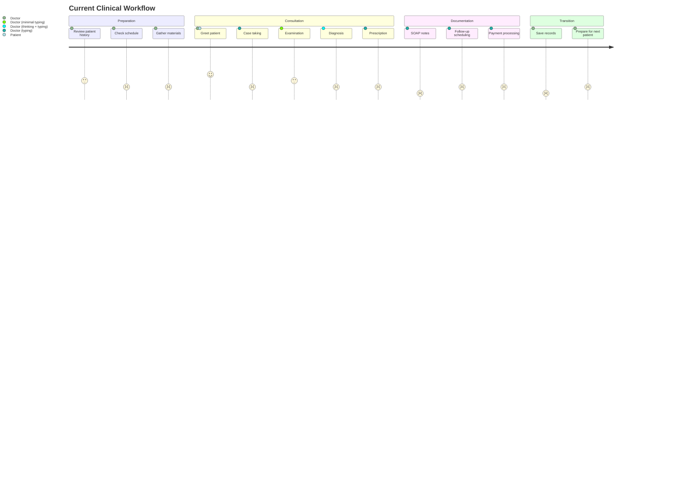
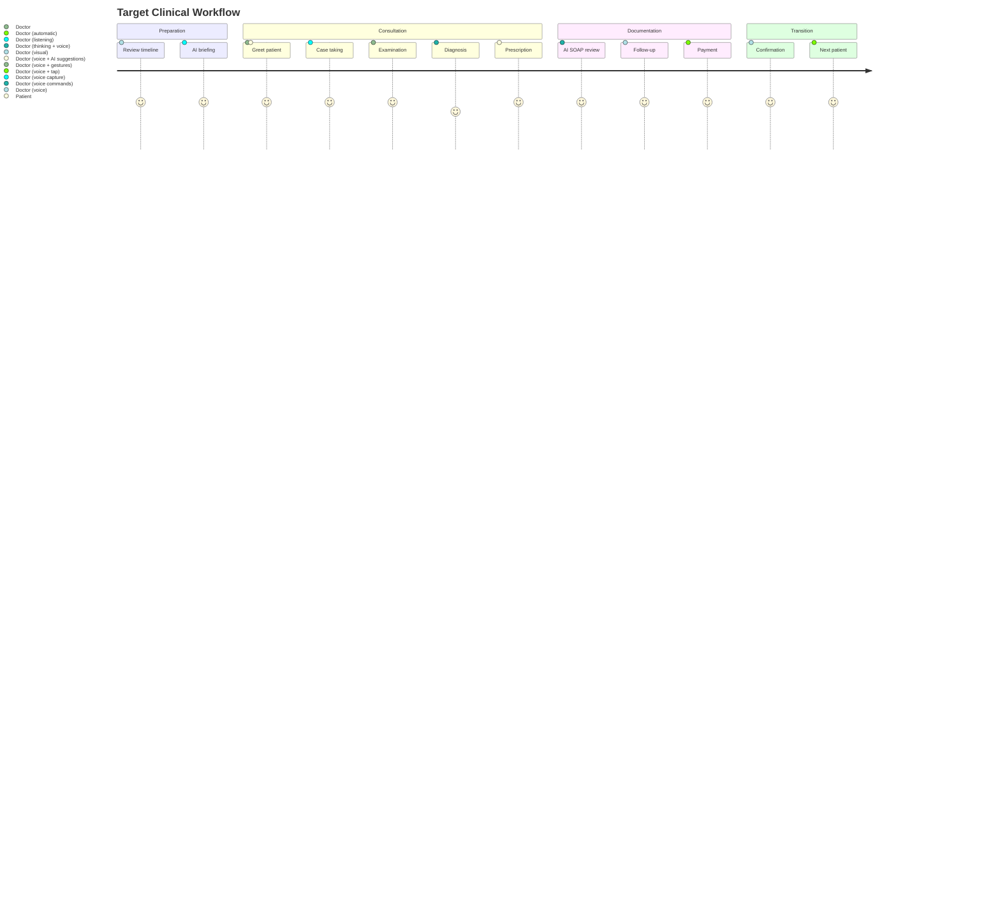

# Sakhi Clinic 2.0 - Clinical Experience Strategy

## Core Objective
Transform the clinical experience from "doctor serves the software" to "software serves the doctor-patient relationship."

## Clinical Workflow Analysis

### 1. Current State (Baseline)


### 2. Target State (Sakhi Clinic 2.0)


## Cognitive Load Analysis

### 1. Cognitive Load Sources in Current Workflow
| Task | Cognitive Load Type | Impact | Current Mitigation | Sakhi Opportunity |
|------|---------------------|--------|---------------------|-------------------|
| Patient history review | Intrinsic | High | Paper notes | AI-generated clinical summary |
| Data entry | Extraneous | High | None | Voice capture + AI structuring |
| Remedy selection | Germane | Medium | Reference books | AI pattern recognition + suggestions |
| Follow-up scheduling | Extraneous | Medium | Manual calendar | AI predictive scheduling |
| Payment processing | Extraneous | High | Manual entry | Voice-activated payment processing |
| Record saving | Extraneous | High | Manual save | Automatic saving with trust indicators |
| Context switching | Extraneous | Very High | None | Unified timeline interface |

### 2. Cognitive Load Reduction Targets
- **Intrinsic Load**: Reduce by 40% through AI-generated summaries and insights
- **Extraneous Load**: Reduce by 80% through voice-first workflow and automation
- **Germane Load**: Increase by 30% by providing clinically relevant patterns and insights

## Interaction Principles

### 1. One-Handed Usage Model
**Core Principle**: All primary actions must be accessible with one thumb in portrait mode.

**Interaction Zones**:
```
+---------------------+
|       Zone 1        |  (Top 20% - Status bar, patient context)
|---------------------|
|                     |
|       Zone 2        |  (Middle 60% - Primary content)
|                     |
|---------------------|
|       Zone 3        |  (Bottom 20% - Primary actions)
+---------------------+
```

**Zone 3 Priority Actions**:
1. Start/end consultation
2. Voice commands
3. Primary navigation
4. Confirm actions
5. Emergency actions

### 2. Gesture Hierarchy
| Gesture | Action | Clinical Context | Feedback |
|---------|--------|------------------|----------|
| Tap | Select/activate | Primary actions | Haptic + visual |
| Long press | Secondary options | Context menus | Haptic + bottom sheet |
| Swipe right | Back/undo | Navigation | Visual transition |
| Swipe left | Next/forward | Consultation flow | Visual transition |
| Swipe up | Open menu | Secondary navigation | Bottom sheet |
| Swipe down | Refresh | Timeline updates | Visual indicator |
| Double tap | Zoom | Timeline/patient history | Visual scale |

### 3. Voice Interaction Model
**Voice Command Structure**: `[Wake word] + [Action] + [Context]`

**Examples**:
- "Sakhi, prescribe Arnica 30C"
- "Sakhi, show patient history"
- "Sakhi, schedule follow-up in 2 weeks"
- "Sakhi, what's the last remedy?"
- "Sakhi, add symptom: persistent cough"

**Voice Feedback Principles**:
- Confirm actions with subtle audio cues
- Use different tones for success/warning/error
- Provide voice summaries for complex actions
- Allow voice interruption for corrections

## Trust Model

### 1. Trust Layers
```
+---------------------+
|   Patient Trust     |  (Visible to patient)
+---------------------+
|   Doctor Trust      |  (Visible to doctor)
+---------------------+
|   System Trust      |  (Internal)
+---------------------+
```

### 2. Trust Indicators
| Context | Indicator Type | Implementation | Clinical Benefit |
|---------|----------------|----------------|------------------|
| Data capture | Visual | Waveform animation | Patient sees recording in progress |
| Data saving | Visual + haptic | Checkmark animation | Doctor knows data is saved |
| AI processing | Visual | Subtle loading indicator | Doctor understands system state |
| Prescription | Visual + voice | Confirmation dialog | Prevents medication errors |
| Follow-up | Visual | Calendar integration | Ensures follow-up compliance |
| Payment | Visual + receipt | Digital receipt | Professional experience |
| Sync status | Visual | Cloud icon state | Doctor knows data is backed up |

### 3. Trust Recovery
**Error Prevention Hierarchy**:
1. **Prevention**: Design to avoid errors (e.g., voice confirmation before destructive actions)
2. **Mitigation**: Reduce impact of errors (e.g., undo functionality)
3. **Recovery**: Easy recovery from errors (e.g., restore from backup)
4. **Transparency**: Clear communication about errors (e.g., error messages with solutions)

## AI Intervention Opportunities

### 1. AI Intervention Framework
| Consultation Phase | AI Opportunity | Clinical Benefit | Trust Consideration |
|--------------------|----------------|------------------|---------------------|
| Preparation | Patient history summary | Reduces review time | Clearly labeled as AI-generated |
| Case taking | Real-time transcription | Eliminates typing | Speaker identification |
| Symptom capture | Symptom extraction | Improves accuracy | Doctor review step |
| Diagnosis | Pattern recognition | Enhances remedy selection | Explainable suggestions |
| Prescription | Remedy suggestions | Reduces cognitive load | Doctor approval required |
| Follow-up | Predictive scheduling | Improves compliance | Doctor confirmation |
| Documentation | SOAP generation | Saves time | Doctor review and edit |
| Post-consultation | Clinical insights | Improves practice | Clearly separated from raw data |

### 2. AI Trust Spectrum
```
Low Trust (Doctor Decision) ←------------------------------------→ High Trust (AI Decision)

[Reminder Suggestions] [Follow-up Timing] [SOAP Structuring] [Symptom Extraction] [Pattern Recognition] [Clinical Insights]
```

## Target Consultation Experience

### 1. Ideal Consultation Timeline
```
0:00 - Patient arrives
     - Doctor greeted with patient context on timeline
     - AI-generated briefing available via voice
     - One-tap consultation start

0:30 - Case taking begins
     - Automatic voice capture starts
     - Real-time transcription displayed
     - Doctor focuses on patient

2:00 - Examination
     - Voice commands for symptom capture
     - AI suggests relevant follow-up questions
     - Doctor approves or modifies

5:00 - Diagnosis
     - AI presents pattern recognition results
     - Remedy suggestions with rationale
     - Doctor selects or overrides

7:00 - Prescription
     - Voice command for remedy selection
     - Dosage suggestions based on history
     - Digital prescription generated

8:30 - Follow-up
     - AI suggests follow-up timing
     - Doctor confirms or adjusts
     - Automatic scheduling

9:00 - Payment
     - Voice-activated payment processing
     - Digital receipt generated
     - Patient receives SMS receipt

9:30 - Consultation complete
     - Automatic save and sync
     - Next patient automatically loaded
     - Doctor receives visual confirmation
```

### 2. Experience Metrics
| Metric | Baseline | Target | Measurement Method |
|--------|----------|--------|---------------------|
| Doctor eye contact | 60% | 90% | Video analysis |
| Consultation time | 15-20 min | <10 min | System tracking |
| Active system interaction | 30-40% | <10% | Usage analytics |
| Documentation errors | 15% | <2% | Audit review |
| Follow-up compliance | 60% | 90% | System tracking |
| Doctor satisfaction | 7/10 | 9.5/10 | Survey |

## Clinical Context Model

### 1. Context States
```
[Idle] → [Preparation] → [Active Consultation] → [Post-Consultation] → [Review]
```

### 2. Context-Aware Interface
| Context | Interface Adaptation | Content Priority | Interaction Mode |
|---------|----------------------|------------------|------------------|
| Idle | Timeline view | Today's appointments | Standard |
| Preparation | Patient history | Upcoming consultations | Voice + touch |
| Active Consultation | Current patient | SOAP notes | Voice-first |
| Post-Consultation | Follow-up | Payment processing | Touch-first |
| Review | Analytics | Patient insights | Standard |

## One-Handed Usage Model

### 1. Thumb Reach Analysis
```
+---------------------+
|  Hard to reach      |
|  +-----------+      |
|  |           |      |
|  |   Zone 1  |      |
|  |           |      |
|  +-----------+      |
|       |             |
|       |             |
|  Zone 2 (Optimal)   |
|       |             |
|       |             |
|  +-----------+      |
|  |           |      |
|  |   Zone 3  |      |
|  | (Primary) |      |
+---------------------+
```

### 2. One-Handed Design Rules
1. **Primary actions** must be in Zone 3 (bottom 20% of screen)
2. **Secondary actions** should be in Zone 2 (middle 60%)
3. **Tertiary information** can be in Zone 1 (top 20%)
4. **Critical actions** must have at least 48x48px touch targets
5. **Related actions** should be grouped within 72px of each other
6. **Navigation** should use bottom navigation bar
7. **Context menus** should appear as bottom sheets
8. **Scrolling** should be vertical only during consultations

## Clinical Interaction Patterns

### 1. Pattern Library
| Pattern | Clinical Application | Implementation | Benefit |
|---------|----------------------|----------------|---------|
| Timeline Scroll | Patient history | Vertical scroll with date markers | Matches chronological thinking |
| Voice Capture | Consultation notes | Always-on recording with visual feedback | Eliminates typing |
| Bottom Sheet | Context menus | Slide-up from bottom | One-handed access |
| Floating Action | Primary action | Persistent button | Always accessible |
| Card Swipe | Quick actions | Horizontal swipe on cards | Reduces taps |
| Haptic Feedback | Confirmation | Subtle vibration | Trust building |
| Voice Summary | AI suggestions | Audio playback | Hands-free review |
| Progressive Disclosure | Complex information | Expandable sections | Reduces cognitive load |
| Undo Gesture | Error recovery | Swipe right | Trust building |

### 2. Pattern Prioritization
1. **Voice Capture** (Eliminates typing)
2. **Timeline Navigation** (Supports clinical thinking)
3. **Bottom Sheet Menus** (One-handed access)
4. **Floating Action Button** (Primary action always available)
5. **Haptic Feedback** (Trust confirmation)
6. **Progressive Disclosure** (Reduces cognitive load)
7. **Undo Gesture** (Error recovery)
8. **Voice Summaries** (Hands-free review)

## Clinical Trust Framework

### 1. Trust Dimensions
| Dimension | Clinical Application | Implementation Strategy |
|-----------|----------------------|-------------------------|
| Reliability | System always works | Offline capability, automatic sync |
| Competence | AI understands medicine | Clinical accuracy validation |
| Integrity | Data is protected | End-to-end encryption, audit logs |
| Benevolence | System serves doctor | Doctor control over AI suggestions |
| Transparency | Clear system state | Visual status indicators |
| Recovery | Easy error correction | Undo functionality, backup system |

### 2. Trust Indicators by Context
| Clinical Context | Trust Indicator | Implementation | Frequency |
|------------------|-----------------|----------------|-----------|
| Consultation start | Recording indicator | Waveform animation | Continuous |
| Data entry | Save confirmation | Checkmark animation | After each entry |
| AI suggestion | Suggestion source | "AI Suggested" label | With each suggestion |
| Prescription | Confirmation dialog | Modal with voice readback | Before finalizing |
| Follow-up | Calendar integration | Visual calendar confirmation | After scheduling |
| Payment | Digital receipt | SMS + app receipt | After payment |
| Sync status | Cloud indicator | Status icon | Continuous |
| Error state | Recovery options | Undo button + error message | On error |

## AI Clinical Integration Strategy

### 1. AI Intervention Model
```
[Observation] → [Understanding] → [Prediction] → [Suggestion] → [Action] → [Learning]
```

### 2. AI Capability Matrix
| Capability | Clinical Value | Trust Level | Implementation | Doctor Control |
|------------|----------------|-------------|----------------|----------------|
| Voice transcription | Eliminates typing | High | Real-time | Review/edit |
| Symptom extraction | Improves accuracy | Medium | Real-time | Approve/reject |
| SOAP generation | Saves time | Medium | Post-consultation | Review/edit |
| Remedy suggestions | Reduces cognitive load | Low | During consultation | Select/override |
| Follow-up timing | Improves compliance | Medium | Post-consultation | Confirm/adjust |
| Clinical insights | Enhances practice | Low | Background | Review |
| Pattern recognition | Improves diagnosis | Medium | Background | Review |
| Patient briefing | Reduces prep time | High | Pre-consultation | Review |

### 3. AI Trust Building
1. **Explainability**: Show AI reasoning for suggestions
2. **Control**: Always allow doctor override
3. **Transparency**: Clearly label AI-generated content
4. **Feedback**: Allow doctors to rate AI suggestions
5. **Learning**: Improve based on doctor feedback
6. **Boundaries**: Clear limits on AI capabilities

## Clinical Experience Optimization

### 1. Optimization Targets
| Area | Current State | Target State | Strategy |
|------|---------------|--------------|----------|
| Doctor-patient interaction | Doctor looks at screen 40% of time | Doctor looks at patient 90% of time | Voice-first workflow |
| Documentation time | 5-7 minutes per consultation | <1 minute per consultation | AI SOAP generation |
| Cognitive load | High (remembering details) | Low (system remembers) | AI memory assistance |
| Remedy selection | Manual reference checking | AI pattern recognition | Clinical decision support |
| Follow-up compliance | 60% | 90% | Predictive scheduling + reminders |
| Error rate | 15% documentation errors | <2% | Real-time validation |
| Trust in system | Low (uncertainty about saves) | High (clear indicators) | Visual trust indicators |

### 2. Experience Principles
1. **Patient-First**: Design for doctor-patient interaction, not system interaction
2. **Invisible Intelligence**: AI should work in the background, not interrupt
3. **Progressive Assistance**: Offer help when needed, stay quiet when not
4. **Clinical Flow**: Match the natural rhythm of homeopathic consultations
5. **Trust Through Transparency**: Never leave the doctor wondering about system state
6. **One-Handed Priority**: All primary actions accessible with one thumb
7. **Voice-First**: Default to voice for all documentation tasks
8. **Chronological Thinking**: Organize information by time, not by category

## Implementation Roadmap (Experience)

### Phase 1: Foundation (4 weeks)
- **Voice infrastructure**: Always-on recording with speaker identification
- **Trust indicators**: Visual feedback for all system states
- **One-handed navigation**: Bottom navigation and FAB implementation
- **Timeline core**: Basic chronological interface

### Phase 2: AI Integration (6 weeks)
- **Voice transcription**: Real-time transcription with medical terminology
- **SOAP generation**: AI-generated clinical notes
- **Symptom extraction**: Automatic symptom identification
- **Trust framework**: AI suggestion labeling and doctor control

### Phase 3: Clinical Workflow (8 weeks)
- **Consultation flow**: End-to-end voice-first workflow
- **Remedy integration**: AI pattern recognition for remedy suggestions
- **Follow-up system**: Predictive scheduling and reminders
- **Payment processing**: Voice-activated payment workflow

### Phase 4: Premium Experience (4 weeks)
- **Micro-interactions**: Delightful animations and feedback
- **Clinical insights**: AI-generated practice insights
- **Patient experience**: Digital receipts and follow-up communications
- **Performance**: Sub-500ms response times for all interactions

## Success Metrics

### 1. Clinical Efficiency
- **Consultation time**: <10 minutes (from 15-20)
- **Active system interaction**: <10% of consultation time (from 30-40%)
- **Documentation errors**: <2% (from 15%)
- **Follow-up compliance**: 90% (from 60%)

### 2. User Experience
- **Doctor satisfaction**: 9.5/10 (from 7/10)
- **Net Promoter Score**: 70+ (from ~30)
- **Adoption rate**: 90%+ of consultations within 3 months
- **Learning time**: <1 hour to basic proficiency

### 3. Clinical Outcomes
- **Remedy accuracy**: 20% improvement through pattern recognition
- **Patient retention**: 30% increase through better follow-up
- **Practice insights**: 50% of doctors using AI-generated insights weekly
- **Trust in system**: 95% of doctors report high trust in data integrity

## Risk Mitigation

### 1. Clinical Risks
| Risk | Mitigation Strategy | Contingency Plan |
|------|---------------------|------------------|
| AI misdiagnosis | Doctor approval required for all suggestions | Manual override capability |
| Voice recognition errors | Medical terminology training + doctor review | Fallback to manual entry |
| Data privacy concerns | End-to-end encryption + HIPAA compliance | Local-only mode option |
| Doctor resistance to AI | Gradual introduction + clear value demonstration | Traditional workflow option |
| System downtime | Offline capability + automatic sync | Manual backup process |

### 2. Technical Risks
| Risk | Mitigation Strategy | Contingency Plan |
| Voice processing latency | Edge computing + optimized algorithms | Text fallback mode |
| Battery drain | Efficient background processing | Battery optimization mode |
| Data synchronization conflicts | Conflict resolution algorithms | Manual merge interface |
| AI bias in suggestions | Diverse training data + doctor feedback | Manual suggestion mode |
| Performance issues | Progressive loading + caching | Simplified interface mode |

## Clinic Operating Modes

### 1. Preparation Mode
**Context**: Doctor arrives at clinic, preparing for first patient
**Interface Characteristics**:
- Timeline view showing today's appointments
- AI-generated briefings for upcoming patients
- Quick access to patient histories
- Voice commands for navigation
- Minimal visual clutter

**Key Behaviors**:
- Automatic sync of overnight updates
- AI-prepared patient summaries
- One-tap consultation start
- Voice briefing capability
- Battery status check

### 2. Active Consultation Mode
**Context**: Doctor is with a patient
**Interface Characteristics**:
- Full-screen patient context
- Voice capture waveform
- Minimal interactive elements
- Large touch targets
- Dark/light mode based on clinic lighting

**Key Behaviors**:
- Continuous voice capture
- Real-time transcription
- AI symptom extraction
- Automatic saving
- Trust indicators for all actions

### 3. Between Patients Mode
**Context**: Doctor finishing with one patient, preparing for next
**Interface Characteristics**:
- Timeline view with next patient highlighted
- Quick review of completed consultation
- One-tap navigation to next patient
- Minimal interaction required

**Key Behaviors**:
- Automatic consultation completion
- Next patient pre-loading
- Quick payment processing
- Follow-up scheduling
- Voice command readiness

### 4. Phone Consultation Mode
**Context**: Remote consultation via phone
**Interface Characteristics**:
- Audio-only interface
- Voice command priority
- Call integration
- Minimal screen interaction
- Loudspeaker optimization

**Key Behaviors**:
- Automatic call recording (with consent)
- Voice-only navigation
- Transcription with speaker identification
- Call duration tracking
- Follow-up scheduling via SMS

### 5. End of Day Mode
**Context**: Doctor closing clinic for the day
**Interface Characteristics**:
- Daily summary view
- Analytics dashboard
- Quick access to reports
- Minimal interaction mode
- Battery optimization

**Key Behaviors**:
- Automatic backup
- Daily summary generation
- Tomorrow's schedule preview
- Practice insights
- Sync status confirmation

## Attention Model

### 1. Attention Shift Minimization
**Principle**: Every attention shift from patient to phone represents a failure of design.

**Attention Zones**:
```
+---------------------+
|   Patient Zone      |  (Doctor's primary focus)
+---------------------+
|   Peripheral Zone   |  (Minimal glances)
+---------------------+
|   Phone Zone        |  (Only when absolutely necessary)
+---------------------+
```

### 2. Attention Shift Triggers
| Trigger | Current Impact | Sakhi Solution | Attention Shift Reduction |
|---------|----------------|----------------|---------------------------|
| Data entry | High | Voice capture | 90% reduction |
| Information lookup | Medium | AI pre-loading | 80% reduction |
| Remedy selection | Medium | AI suggestions | 70% reduction |
| Follow-up scheduling | Medium | Predictive scheduling | 85% reduction |
| Payment processing | High | Voice-activated | 95% reduction |
| Record saving | High | Automatic saving | 100% elimination |

### 3. Attention Management Techniques
1. **Peripheral Vision Design**: Key information visible at edge of vision
2. **Audio Cues**: Subtle sounds for important events
3. **Haptic Feedback**: Vibration patterns for confirmation
4. **Voice Summaries**: Audio playback of key information
5. **Progressive Disclosure**: Only show what's needed when it's needed
6. **Automatic Transitions**: System handles context changes
7. **Trust Indicators**: Visual confirmation without requiring attention

## Doctor Memory Model

### 1. AI Learning Framework
```
[Observation] → [Pattern Recognition] → [Prediction] → [Suggestion] → [Feedback] → [Learning]
```

### 2. Memory Domains
| Domain | Learning Objective | Implementation | Trust Level |
|--------|--------------------|----------------|-------------|
| Remedy Preferences | Doctor's preferred remedies for specific symptoms | Analyze prescription patterns | High |
| Dosage Patterns | Typical dosages and potencies used | Analyze historical prescriptions | Medium |
| Follow-up Intervals | Doctor's typical follow-up timing | Analyze scheduling patterns | High |
| Fee Structure | Doctor's pricing for different consultation types | Analyze payment records | High |
| Clinical Questions | Doctor's typical case-taking questions | Analyze consultation transcripts | Medium |
| Patient Communication | Doctor's preferred communication style | Analyze follow-up messages | Low |
| Workflow Patterns | Doctor's consultation flow | Analyze interaction patterns | High |
| Symptom Clusters | Doctor's approach to symptom grouping | Analyze SOAP notes | Medium |

### 3. Learning Implementation
**Phase 1: Observation** (First 10 consultations)
- Passive data collection
- Pattern identification
- Baseline establishment

**Phase 2: Prediction** (Next 20 consultations)
- Confidence-based suggestions
- Doctor feedback collection
- Pattern refinement

**Phase 3: Anticipation** (Ongoing)
- Proactive suggestions
- Context-aware predictions
- Continuous learning
- Doctor control over learning

## Human Factors & Real Clinic Conditions

### 1. Environmental Conditions
| Condition | Impact | Design Solution |
|-----------|--------|------------------|
| Bright sunlight | Screen visibility | High contrast mode, adaptive brightness |
| Dim lighting | Eye strain | Dark mode, reduced blue light |
| Noise | Voice recognition | Directional microphone, noise cancellation |
| Distractions | Cognitive load | Minimalist interface, clear focus states |
| Interruptions | Workflow disruption | Quick resume, state preservation |
| Gloves | Touch accuracy | Larger touch targets, gesture alternatives |
| Movement | One-handed use | Bottom navigation, thumb zone optimization |

### 2. Technical Constraints
| Constraint | Impact | Design Solution |
|------------|--------|------------------|
| Poor connectivity | Sync failures | Offline-first design, sync queue |
| Battery life | App usage | Power optimization, background sync |
| Storage limits | Data retention | Smart caching, cloud backup |
| Device variability | UI consistency | Responsive design, adaptive layouts |
| Permission restrictions | Feature access | Graceful degradation, permission handling |

### 3. Human Factors
| Factor | Impact | Design Solution |
|-------|--------|------------------|
| Fatigue | Error rate | Simplified interfaces, voice priority |
| Stress | Cognitive load | Progressive disclosure, clear hierarchy |
| Multitasking | Attention | Minimal attention shifts, audio cues |
| Memory load | Recall | AI memory assistance, reminders |
| Decision fatigue | Quality | AI suggestions, pattern recognition |
| Time pressure | Speed | One-tap actions, voice commands |

## Failure Recovery & Trust Model

### 1. Failure Modes
| Failure Type | Example | Detection | Recovery | Trust Restoration |
|--------------|---------|-----------|----------|-------------------|
| Voice recognition | Misheard remedy name | Confidence scoring | Manual override | Clear error indication |
| Sync failure | Data not saved to cloud | Sync status indicator | Local queue | Automatic retry, manual sync |
| Storage failure | Cannot save consultation | Storage warning | Emergency backup | Data recovery process |
| Permission failure | Cannot access microphone | Permission prompt | Graceful degradation | Clear explanation |
| Connectivity failure | No internet connection | Offline indicator | Offline mode | Sync on reconnect |
| Battery failure | Device shutting down | Battery warning | Emergency save | Data preservation |
| AI failure | Incorrect remedy suggestion | Confidence indicator | Manual selection | Feedback mechanism |

### 2. Recovery Principles
1. **Graceful Degradation**: Maintain core functionality when features fail
2. **State Preservation**: Never lose data or context
3. **Clear Communication**: Always show what's happening and why
4. **Recovery Paths**: Provide multiple ways to recover from failures
5. **Trust Indicators**: Show system status and data integrity
6. **Doctor Control**: Always allow manual override
7. **Automatic Recovery**: Fix problems without doctor intervention when possible

### 3. Trust Restoration Framework
```
[Failure Detection] → [Clear Communication] → [Recovery Options] → [State Verification] → [Trust Indicators]
```

**Example: Voice Recognition Failure**
1. **Detection**: Low confidence score on remedy name
2. **Communication**: "I heard 'Arnica 30C' - is that correct?"
3. **Recovery Options**:
   - Tap to confirm
   - Voice correction
   - Manual selection
4. **State Verification**: Confirmation dialog with visual check
5. **Trust Indicators**: Save confirmation, sync status

## Clinical Experience Blueprint

### 1. Core Experience Pillars
1. **Voice-First**: Eliminate typing through continuous voice capture
2. **Timeline-Centric**: Organize all information chronologically
3. **AI-Assisted**: Augment, don't replace, clinical judgment
4. **One-Handed**: Design for clinical reality
5. **Trust-Built**: Never leave the doctor wondering
6. **Patient-Focused**: Enhance, don't distract from, patient interaction
7. **Resilient**: Work in real-world clinic conditions
8. **Learning**: Adapt to the doctor's unique practice

### 2. Experience Principles Checklist
- [ ] Every interaction can be performed with one hand
- [ ] Voice is the primary input method for documentation
- [ ] AI suggestions are clearly labeled and doctor-approved
- [ ] System state is always visible and understandable
- [ ] All actions have immediate visual confirmation
- [ ] Error recovery is simple and intuitive
- [ ] Information is organized chronologically
- [ ] Cognitive load is minimized through progressive disclosure
- [ ] Trust indicators are present for all critical actions
- [ ] The doctor always maintains control
- [ ] System works in poor connectivity conditions
- [ ] Battery usage is optimized for full clinic days
- [ ] Attention shifts from patient to phone are minimized
- [ ] The system learns and adapts to the doctor's practice
- [ ] Failure recovery preserves data and context

### 3. Clinical Validation Framework
**Validation Method**: Simulated clinical sessions with homeopathic doctors
**Metrics**:
- Eye contact percentage
- Consultation time
- Documentation errors
- Doctor satisfaction scores
- System trust ratings
- Cognitive load assessment
- Attention shift count
- Failure recovery success rate
- Battery life impact
- Connectivity resilience

**Validation Process**:
1. Baseline measurement with current workflow
2. Prototype testing with new experience
3. Environmental condition testing (lighting, noise, etc.)
4. Failure scenario testing
5. Iterative refinement based on feedback
6. Final validation with diverse doctor population
7. Continuous improvement post-launch